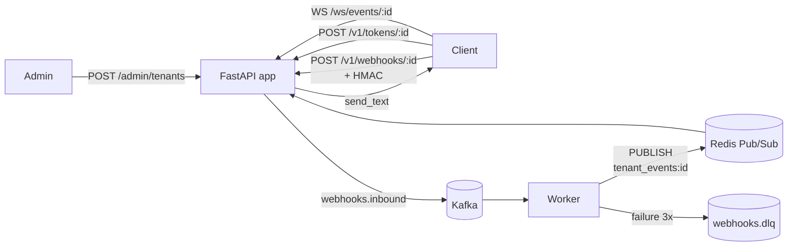

# Webhooks Platform

[🇧🇷 Portuguese version](README.pt-br.md)

Multi-tenant platform for **ingestion, idempotent processing, and real-time distribution** of webhooks. Built with FastAPI + Kafka + Redis + PostgreSQL, featuring WebSocket pub/sub for push delivery to end clients.

> **Full product documentation:** Check the Docusaurus site at `http://localhost:3001` (starts via `docker compose up -d`). Content organized in Quick Start, API Reference, WebSockets, and Error Handling sections.

---

## Table of Contents

- [Architecture](#architecture)
- [Stack](#stack)
- [Prerequisites](#prerequisites)
- [Quick Start (5 minutes)](#quick-start-5-minutes)
- [URLs and Ports](#urls-and-ports)
- [Environment Variables](#environment-variables)
- [Testing](#testing)
- [Documentation](#documentation)
- [Contributing](#contributing)
- [License](#license)
- [Disclaimer](#disclaimer)

---

## Architecture



- **`app`** — FastAPI: Admin API, webhook ingestor, WS token issuer, WebSocket endpoint.
- **`worker`** — Dedicated Kafka consumer: idempotency (Redis), exponential retry, DLQ, and pub/sub.
- **`docs`** — Docusaurus site (Nginx serving static files).
- **`db`** — PostgreSQL 16 (tenants, admins).
- **`redis`** — Redis 7 (credential cache, idempotency locks, pub/sub).
- **`kafka`** — Kafka 3.7 (KRaft, single-broker for dev).

---

## Stack

| Layer | Technology |
| --- | --- |
| Language | Python 3.12 |
| Web framework | FastAPI + Uvicorn |
| ORM / Migrations | SQLAlchemy (async) + Alembic |
| Messaging | Apache Kafka (`aiokafka`) |
| Cache / Pub-Sub | Redis 7 |
| Database | PostgreSQL 16 |
| Tests | `pytest`, `pytest-asyncio`, `httpx`, `httpx-ws`, `testcontainers[kafka]` |
| Docs | Docusaurus 3 (Node 20 build → Nginx Alpine runtime) |
| Infra | Docker Compose |

---

## Prerequisites

- **Docker** ≥ 24 + **Docker Compose** v2.
- (Optional for running outside Docker) **Python 3.12+**, **Node 20+**.
- (Optional, recommended) **`make`**, **`curl`**, **`jq`**, **`openssl`**.

For Windows, use **WSL2** or **Docker Desktop**. Commands below are portable (PowerShell, bash, and zsh).

---

## Quick Start (5 minutes)

### 1. Clone and set up environment

```bash
git clone https://github.com/yourusername/easyhooks.git
cd easyhooks

# Copy environment template and configure
cp .env.example .env
```

**Important:** Edit `.env` and set secure values for:
- `POSTGRES_PASSWORD`
- `ADMIN_SEED_TOKEN`
- `APP_SECRET_KEY`

Generate secure random values:

```bash
# On Linux/macOS/WSL
openssl rand -hex 32

# On Windows PowerShell
[Convert]::ToBase64String((1..32 | ForEach-Object { Get-Random -Maximum 256 }))
```

### 2. Start the stack

```bash
docker compose up -d
docker compose ps        # confirm all services are healthy
```

First startup takes ~1-2 minutes (Python image build + base images download). Subsequent starts are almost instant.

### 3. Verify everything is running

- API: <http://localhost:8000/docs> (Swagger UI).
- Documentation: <http://localhost:3001>.
- Redis: `docker compose exec redis redis-cli ping` → `PONG`.
- Kafka: `docker compose exec kafka /opt/kafka/bin/kafka-topics.sh --bootstrap-server localhost:9092 --list`.

### 4. Create your first tenant

```bash
curl -X POST http://localhost:8000/admin/tenants \
  -H "Authorization: Bearer <YOUR_ADMIN_SEED_TOKEN>" \
  -H "Content-Type: application/json" \
  -d '{"name":"Acme Inc."}'
```

Response:

```json
{
  "tenant_id": "f1a2b3c4-d5e6-7890-abcd-ef0123456789",
  "secret_key": "a-very-long-base64url-secret-..."
}
```

> The `secret_key` is shown **only once**. Save it securely.

### 5. Send your first event

```bash
export TENANT_ID="<the tenant_id from response>"
export SECRET="<the secret_key from response>"

BODY='{"event":"order.created","data":{"id":1}}'
SIG="sha256=$(printf '%s' "$BODY" | openssl dgst -sha256 -hmac "$SECRET" -hex | awk '{print $2}')"

curl -i -X POST "http://localhost:8000/v1/webhooks/$TENANT_ID" \
  -H "X-Webhook-Signature: $SIG" \
  -H "X-Event-Id: evt-001" \
  -H "Content-Type: application/json" \
  -d "$BODY"
```

Expected response: `HTTP/1.1 202 Accepted`.

### 6. Watch the worker processing

```bash
docker compose logs -f worker
```

You'll see something like:

```
INFO  Acquired idempotency lock for event_id=evt-001 ...
INFO  Published event to tenant channel tenant_events:f1a2b3c4-...
```

For details (HMAC, WebSocket, DLQ, examples in other languages), see the documentation at <http://localhost:3001>.

---

## URLs and Ports

| Service | Local URL | Internal Port | Description |
| --- | --- | --- | --- |
| API (Swagger UI) | <http://localhost:8000/docs> | 8000 | Interactive OpenAPI |
| API (ReDoc) | <http://localhost:8000/redoc> | 8000 | Alternative docs |
| API root | <http://localhost:8000/> | 8000 | FastAPI |
| Documentation | <http://localhost:3001> | 80 | Docusaurus site (Nginx) |
| PostgreSQL | localhost:5432 | 5432 | user from .env |
| Redis | localhost:6379 | 6379 | no auth (dev) |
| Kafka | localhost:9092 | 9092 | PLAINTEXT listener |

---

## Environment Variables

All variables can be configured via `.env` file in the project root. Copy `.env.example` to `.env` and customize.

| Variable | Description | Example |
| --- | --- | --- |
| `DATABASE_URL` | PostgreSQL connection string | `postgresql+asyncpg://webhooks:password@db:5432/webhooks` |
| `POSTGRES_USER` | PostgreSQL username | `webhooks` |
| `POSTGRES_PASSWORD` | PostgreSQL password | `changeme123` |
| `POSTGRES_DB` | PostgreSQL database name | `webhooks` |
| `REDIS_URL` | Redis connection string | `redis://redis:6379/0` |
| `KAFKA_BOOTSTRAP_SERVERS` | Kafka broker addresses | `kafka:9092` |
| `KAFKA_WEBHOOK_TOPIC` | Inbound webhook topic | `webhooks.inbound` |
| `KAFKA_DLQ_TOPIC` | Dead letter queue topic | `webhooks.dlq` |
| `KAFKA_CONSUMER_GROUP` | Consumer group ID | `webhook-workers` |
| `WORKER_MAX_RETRIES` | Max retries before DLQ | `3` |
| `WORKER_BACKOFF_BASE_MS` | Exponential backoff base (ms) | `100` |
| `IDEMPOTENCY_TTL_SECONDS` | Idempotency lock TTL | `86400` |
| `ADMIN_SEED_TOKEN` | Bootstrap admin token (MUST CHANGE) | `change-this-to-a-secure-random-token` |
| `APP_SECRET_KEY` | WS token signing key (MUST CHANGE) | `change-this-to-a-secure-random-key` |
| `WS_TOKEN_TTL_SECONDS` | WebSocket token TTL | `300` |
| `TENANT_EVENTS_CHANNEL_PREFIX` | Pub/Sub channel prefix | `tenant_events:` |
| `TENANT_EVENTS_STREAM_PREFIX` | Redis stream prefix | `stream:tenant:` |
| `STREAM_MAX_LEN` | Max stream length | `1000` |
| `STREAM_HISTORY_COUNT` | History count on connect | `50` |
| `CORS_ORIGINS` | Allowed CORS origins | `http://localhost:3001,http://localhost:3000` |
| `SECRET_KEY_BYTES` | Tenant secret entropy | `32` |

> **Production:** Always set `ADMIN_SEED_TOKEN` and `APP_SECRET_KEY` via secret manager. Rotate before promoting.

---

## Testing

The test suite has **29 tests** distributed across 6 groups:

- **Group 1 — Governance** (5): admin auth, tenant creation, Redis sync.
- **Group 2 — Security** (5): multi-tenant isolation, Bearer + HMAC.
- **Group 3 — Ingestion** (3): Kafka production, headers, `X-Event-Id` validation.
- **Group 4 — Idempotency** (1): Redis lock prevents reprocessing.
- **Group 5 — Resilience** (2): exponential retry and DLQ after exhausting attempts.
- **Group 6 — Distribution** (13): HMAC tokens, WebSocket, Pub/Sub end-to-end.

```bash
# Run all tests
pytest

# Run a specific group
pytest tests/test_group_2_security.py -v

# Run with coverage
pytest --cov=src --cov-report=term-missing

# Run a single test
pytest tests/test_group_4_idempotency.py::test_should_skip_already_processed_event -v
```

> Groups 4-6 use **`testcontainers[kafka]`**, which spins up an ephemeral Kafka broker. Requires Docker running. Total suite time: ~50s.

---

## Documentation

The project includes comprehensive documentation via Docusaurus.

### Viewing Documentation

```bash
docker compose up -d docs
# Open http://localhost:3001
```

### Editing Documentation

Documentation files are in `docs/docs/` (pure markdown with Docusaurus frontmatter).

#### Hot reload in dev mode

```bash
cd docs
npm install        # first time only
npm start          # http://localhost:3000 with hot reload
```

#### Validate production build

```bash
cd docs
npm run build      # generates docs/build/
npm run serve      # serves docs/build/ at http://localhost:3000
```

---

## Contributing

### TDD Workflow

This project was implemented following strict TDD (Red → Green → Refactor). Please maintain this standard:

1. Before adding a feature, write the test in `tests/test_group_<N>_<theme>.py`.
2. Run `pytest tests/test_group_X.py -v` and watch it fail.
3. Implement the minimum to pass.
4. Refactor while keeping green.

### Code Standards

- **Type hints required** in public signatures.
- **Async-first**: all IO-bound operations use `async/await`.
- **No obvious comments** — comment only non-trivial decisions.
- **Pydantic** for schemas (request/response).
- **SQLAlchemy 2.0 style** (`select(...)`, async session).

### Before Opening a PR

```bash
pytest                         # 29/29 green
cd docs && npm run build       # clean build
```

---

## License

This project is licensed under the Apache License 2.0 - see the [LICENSE](LICENSE) file for details.

```
Copyright © 2026 Gustavo Bium Donadon
```

---

## Disclaimer

This project is provided "as is" for study and free use purposes. While it implements production-ready patterns (idempotency, retry logic, DLQ, multi-tenancy), it is primarily intended for educational purposes and as a starting point for webhook infrastructure implementations.

**Use in production at your own risk.** Always conduct thorough security audits, load testing, and customize the system to your specific requirements before deploying to production environments.

---

## Resources

- **Product Documentation:** <http://localhost:3001> (after `docker compose up -d docs`)
- **Swagger UI:** <http://localhost:8000/docs>
- **Original Specifications:** [`work/`](work/) — one `.md` per group (1-6) describing requirements.

---

**Built with ❤️ using FastAPI, Kafka, Redis, and PostgreSQL**
