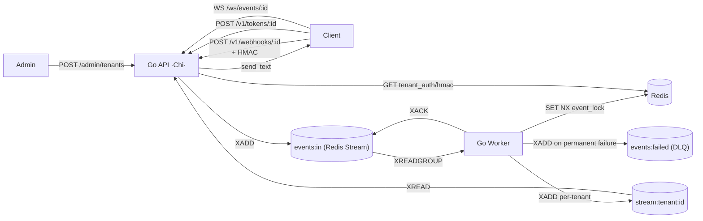

# Easyhooks

[🇧🇷 Portuguese version](README.pt-br.md)

Multi-tenant platform for **ingestion, idempotent processing, and real-time
distribution** of webhooks. **Go (Chi) + Redis only** — no Kafka, no PostgreSQL.
Redis Streams power both the work queue (`events:in` / `events:failed`) and the
per-tenant fan-out streams consumed by the WebSocket layer.

> **Full product documentation:** see the Docusaurus site at
> <http://localhost:3001> (starts via `docker compose up -d`).

---

## Table of Contents

- [Architecture](#architecture)
- [Stack](#stack)
- [Prerequisites](#prerequisites)
- [Quick Start (5 minutes)](#quick-start-5-minutes)
- [URLs and Ports](#urls-and-ports)
- [Environment Variables](#environment-variables)
- [Capacity planning](#capacity-planning)
- [Observability](#observability)
- [Testing](#testing)
- [Load Testing](#load-testing)
- [Documentation](#documentation)
- [Troubleshooting](#troubleshooting)
- [Contributing](#contributing)
- [License](#license)
- [Disclaimer](#disclaimer)

---

## Architecture



- **`app`** — Go/Chi: admin API, webhook ingestor, WS token issuer, WebSocket
  endpoint, HTTP metrics middleware. Publishes inbound events with `XADD events:in`.
- **`worker`** — Redis Streams consumer (`XREADGROUP > webhook-workers`):
  idempotency lock, exponential retry, fan-out to per-tenant streams, DLQ to
  `events:failed`.
- **`redis`** — Sole datastore. Holds the bootstrap admin token hash, all tenant
  credentials, idempotency locks, the work queue and the per-tenant streams.
  Persistence is on (AOF every second + RDB snapshots) so data survives restarts.
- **`docs`** — Docusaurus site (Nginx serving the static build).

The optional observability stack (Prometheus, Grafana, Jaeger, redis-exporter)
lives in a separate compose file — opt in only when you need it.

---

## Stack

| Layer | Technology |
| --- | --- |
| Language | Go 1.26 (toolchain auto) |
| Web framework | Chi (`go-chi/chi`) + `net/http` stdlib |
| Datastore | Redis 7 (`go-redis/v9`) — credentials, work queue, per-tenant streams |
| Work queue | Redis Streams (`events:in`, `events:failed`, consumer group `webhook-workers`) |
| Observability | Prometheus + Grafana + Jaeger (OpenTelemetry) — optional, separate compose file |
| Load Testing | Grafana k6 (HTTP + WebSocket scenarios under `load_tests/k6/`) |
| Tests | `testing` stdlib + `testify` + `miniredis` |
| Docs | Docusaurus 3 (Node 20 build → Nginx Alpine runtime) |
| Infra | Docker Compose |

---

## Prerequisites

- **Docker** ≥ 24 + **Docker Compose** v2.
- (Optional, for running outside Docker) **Go 1.26+**, **Node 20+**.
- (Optional, recommended) **`make`**, **`curl`**, **`jq`**, **`openssl`**.

For Windows, use **WSL2** or **Docker Desktop**.

---

## Quick Start (5 minutes)

### 1. Clone and set up environment

```bash
git clone https://github.com/gbiumdonadon/easyhooks.git
cd easyhooks

cp .env.example .env
```

**Important:** Edit `.env` and set secure values for:

- `ADMIN_SEED_TOKEN`
- `APP_SECRET_KEY`
- `GRAFANA_ADMIN_PASSWORD` *(only needed if you start the monitoring stack)*

Generate secure random values:

```bash
# Linux/macOS/WSL
openssl rand -hex 32

# Windows PowerShell
[Convert]::ToBase64String((1..32 | ForEach-Object { Get-Random -Maximum 256 }))
```

### 2. Start the application stack

```bash
docker compose up -d
docker compose ps
```

### 3. (Optional) Start the observability stack

```bash
docker compose -f docker-compose.yml -f docker-compose.monitoring.yml up -d
```

This brings up Prometheus, Grafana, Jaeger and `redis-exporter` (with Redis
Streams metrics enabled), all attached to the same network so they can scrape
`app:8000` and `redis:6379`.

### 4. Verify everything is running

- API: <http://localhost:8000/health>.
- Documentation: <http://localhost:3001>.
- Redis: `docker compose exec redis redis-cli ping` → `PONG`.
- Stream sanity: `docker compose exec redis redis-cli XINFO GROUPS events:in`.

### 5. Create your first tenant

```bash
curl -X POST http://localhost:8000/admin/tenants \
  -H "Authorization: Bearer <YOUR_ADMIN_SEED_TOKEN>" \
  -H "Content-Type: application/json" \
  -d '{"name":"Acme Inc."}'
```

Response:

```json
{
  "tenant_id": "f1a2b3c4-d5e6-7890-abcd-ef0123456789",
  "secret_key": "a-very-long-base64url-secret-..."
}
```

> The `secret_key` is shown **only once**. Save it securely.

### 6. Send your first event

```bash
export TENANT_ID="<the tenant_id from response>"
export SECRET="<the secret_key from response>"

BODY='{"event":"order.created","data":{"id":1}}'
SIG="sha256=$(printf '%s' "$BODY" | openssl dgst -sha256 -hmac "$SECRET" -hex | awk '{print $2}')"

curl -i -X POST "http://localhost:8000/v1/webhooks/$TENANT_ID" \
  -H "X-Webhook-Signature: $SIG" \
  -H "X-Event-Id: evt-001" \
  -H "Content-Type: application/json" \
  -d "$BODY"
```

Expected response: `HTTP/1.1 202 Accepted`.

### 7. Watch the worker processing

```bash
docker compose logs -f worker
```

You'll see something like:

```
INFO  Worker started stream=events:in dlq_stream=events:failed group=webhook-workers ...
INFO  Published event to stream tenant_id=f1a2b3c4-... stream_id=1700000000000-0
```

For details (HMAC, WebSocket, DLQ, examples in other languages), see the
documentation at <http://localhost:3001>.

---

## URLs and Ports

| Service | Local URL | Internal Port | Description |
| --- | --- | --- | --- |
| API health | <http://localhost:8000/health> | 8000 | Health check |
| API root | <http://localhost:8000/> | 8000 | Go API (Chi) |
| Metrics | <http://localhost:8000/metrics> | 8000 | Prometheus metrics |
| Documentation | <http://localhost:3001> | 80 | Docusaurus site (Nginx) |
| Redis | localhost:6379 | 6379 | no auth (dev) |
| **Grafana** *(opt-in)* | <http://localhost:3000> | 3000 | Dashboards (creds from `.env`) |
| **Prometheus** *(opt-in)* | <http://localhost:9090> | 9090 | Metrics & queries |
| **Jaeger** *(opt-in)* | <http://localhost:16686> | 16686 | Distributed tracing |

---

## Environment Variables

All variables are configured via `.env` in the project root. Copy `.env.example`
to `.env` and customize.

| Variable | Description | Default |
| --- | --- | --- |
| `EASYHOOKS_PROFILE` | Capacity profile (`small`/`medium`/`large`/`custom`) — drives memory-related defaults | `small` |
| `REDIS_URL` | Redis connection string | `redis://redis:6379/0` |
| `REDIS_POOL_SIZE` | Redis client pool size (profile-driven) | small=50, medium=100, large=200 |
| `ADMIN_SEED_TOKEN` | Bootstrap admin Bearer token **(MUST CHANGE)** | *(generated)* |
| `APP_SECRET_KEY` | WS token signing key **(MUST CHANGE)** | *(generated)* |
| `EVENT_STREAM_KEY` | Inbound work-queue stream | `events:in` |
| `DLQ_STREAM_KEY` | Dead Letter Queue stream | `events:failed` |
| `CONSUMER_GROUP` | Consumer group used by the worker | `webhook-workers` |
| `STREAM_BLOCK_MS` | XREADGROUP block timeout (ms) | `5000` |
| `STREAM_COUNT` | Max batch size returned per Read | `32` |
| `WORKER_MAX_RETRIES` | Max retries before DLQ | `3` |
| `WORKER_BACKOFF_BASE_MS` | Exponential backoff base (ms) | `100` |
| `IDEMPOTENCY_TTL_SECONDS` | Idempotency lock TTL | `86400` |
| `WS_TOKEN_TTL_SECONDS` | WebSocket token TTL | `300` |
| `AUTH_SESSION_TTL_SECONDS` | Cached bearer session TTL | `300` |
| `TENANT_EVENTS_STREAM_PREFIX` | Per-tenant stream prefix | `stream:tenant:` |
| `STREAM_MAX_LEN` | Max length per tenant stream (profile-driven) | small=1000, medium=5000, large=10000 |
| `STREAM_HISTORY_COUNT` | History size on WS connect | `50` |
| `WS_FANOUT_BUFFER_SIZE` | Buffered channel per WS subscriber (profile-driven) | small=100, medium=256, large=512 |
| `INGEST_MAX_QUEUE_DEPTH` | High watermark on `XLEN events:in` — above it the API returns 429 (profile-driven) | small=5000, medium=25000, large=50000 |
| `QUEUE_DEPTH_POLL_MS` | How often the API samples `XLEN` for the load shedder | `1000` |
| `QUEUE_DEPTH_LOW_WATER_PCT` | Hysteresis: release shedding when depth drops to `high * pct / 100` | `80` |
| `CORS_ORIGINS` | Allowed CORS origins | `http://localhost:3001,http://localhost:3000` |
| `SECRET_KEY_BYTES` | Tenant secret entropy | `32` |
| `OTEL_EXPORTER_OTLP_ENDPOINT` | OTLP endpoint (Jaeger) | `http://jaeger:4317` |
| `OTEL_SERVICE_NAME` | Service name for tracing | `easyhooks` |
| `METRICS_ENABLED` | Enable Prometheus metrics | `true` |
| `TRACING_ENABLED` | Enable distributed tracing | `true` |
| `TRACING_SAMPLE_RATE` | Tracing sampling rate (0.0–1.0) | `1.0` |
| `GRAFANA_ADMIN_USER` | Grafana admin user *(monitoring stack only)* | `admin` |
| `GRAFANA_ADMIN_PASSWORD` | Grafana admin password **(MUST CHANGE)** | *(generated)* |
| `LOADTEST_ADMIN_TOKEN` | Admin token for load tests (mirror `ADMIN_SEED_TOKEN`) | *(same as ADMIN_SEED_TOKEN)* |
| `LOADTEST_API_BASE_URL` | Target URL for load tests | `http://localhost:8000` |

> **Production:** always set `ADMIN_SEED_TOKEN`, `APP_SECRET_KEY` (and
> `GRAFANA_ADMIN_PASSWORD` when enabling monitoring) via a secret manager.
> Rotate before promoting. Adjust `TRACING_SAMPLE_RATE` to 0.1–0.2.

---

## Capacity planning

EasyHooks ships three pre-tuned profiles that scale memory limits, Redis pool
size, per-tenant stream caps, fanout buffers and ingestion backpressure
together. Pick one based on the container memory budget you can give it.

> **Behavioural guarantee.** EasyHooks prioritises server integrity. Under
> extreme load it prefers to **reject new requests with HTTP 429** rather
> than crash the service via OOM.

| Profile | Recommended container | `GOMEMLIMIT` | `INGEST_MAX_QUEUE_DEPTH` | `STREAM_MAX_LEN` | `REDIS_POOL_SIZE` |
| --- | --- | --- | --- | --- | --- |
| `small`  | 256 MB | 200 MiB | 5 000  | 1 000  | 50  |
| `medium` | 512 MB | 450 MiB | 25 000 | 5 000  | 100 |
| `large`  | 1 GB   | 900 MiB | 50 000 | 10 000 | 200 |
| `custom` | (yours)| set yourself | set yourself | set yourself | set yourself |

Pick a profile in `.env`:

```env
EASYHOOKS_PROFILE=medium
```

Any individual env var still wins over the profile, so `EASYHOOKS_PROFILE=large`
plus `STREAM_MAX_LEN=20000` is a valid combination.

### Measured behaviour at saturation

Numbers from `load_tests/scripts/run_capacity_benchmark.ps1` (single dev box,
100 k6 VUs, 30 s sustained, single tenant, payload ≈ 100 B). The k6 workload
exceeds every profile's accept rate on purpose so we can compare backpressure.

| Profile | Container cap | Total req/s offered | 202 Accepted (30 s) | 429 Shed (30 s) | p95 latency | App RSS |
| --- | --- | --- | --- | --- | --- | --- |
| `small`  | 256 MB | ~4 700 | 5 446  | 135 812 | 1.58 ms | ~26 MiB |
| `medium` | 512 MB | ~4 700 | 28 827 | 112 370 | 1.58 ms | ~26 MiB |
| `large`  | 1 GB   | ~4 700 | 52 169 | 88 903  | 1.66 ms | ~27 MiB |

All three profiles stayed up — no OOM, no crash, no panics. The 429 path is
cheap (atomic read + early return), so p95 ingest latency stays sub-2 ms even
under heavy backpressure. Larger profiles absorb bigger bursts before
shedding engages.

See [`docs/docs/getting-started/sizing.md`](docs/docs/getting-started/sizing.md)
for the full guide (tuning knobs, observability, methodology, reproduction
script).

> **Roadmap.** A `sync.Pool` for the ingestion path is intentionally not in
> this release — current allocation patterns are well within `GOMEMLIMIT` for
> the measured load. We will revisit if profiling shows it becomes a hot spot.

---

## Observability

Bring up the optional stack with:

```bash
docker compose -f docker-compose.yml -f docker-compose.monitoring.yml up -d
```

### Quick access

- **Grafana** — <http://localhost:3000> (creds from `.env`).
- **Prometheus** — <http://localhost:9090>.
- **Jaeger** — <http://localhost:16686>.

### Key metrics

#### 1. Worker backlog (XPENDING) ⚠️ **CRITICAL**

```promql
redis_stream_group_pending{stream="events:in",group="webhook-workers"}
```

- **Healthy**: < 100 pending entries.
- **Warning**: 100–500.
- **Critical**: > 1000 (worker is falling behind — scale horizontally).

#### 2. Stream length (queue depth)

```promql
redis_stream_length{stream="events:in"}
redis_stream_length{stream="events:failed"}
```

#### 3. DLQ rate

```promql
rate(webhook_dlq_total[5m]) / rate(stream_consume_total[5m])
```

#### 4. Processing duration p95

```promql
histogram_quantile(0.95, rate(webhook_processing_duration_seconds_bucket[5m]))
```

### Dashboards

Three dashboards are auto-provisioned:

1. **EasyHooks Overview** — RPS, p95 latency, WS connections, DLQ ratio.
2. **EasyHooks Redis Streams Metrics** — XPENDING, throughput, XLEN.
3. **EasyHooks Load Test** — request rate, latency percentiles, stream pending
   backlog while a k6 run is in progress.

### Distributed tracing

A complete trace covers `webhook.ingest` → `webhook.publish_stream` →
`webhook.process` (worker) → `webhook.business_handler` → `webhook.dispatch_to_dlq`
(when applicable) → `websocket.send`.

---

## Testing

```bash
cd go-api
go test ./...
go test -race ./...
go test -cover ./...
```

The unit suite uses `miniredis`, so it does not require a live Redis instance.

---

## Load Testing

EasyHooks ships with a Grafana k6 suite under `load_tests/k6/`.

### From inside Docker (recommended)

```bash
docker compose up -d
docker compose -f load_tests/docker-compose.loadtest.yml run --rm k6 \
  run k6/scenarios/baseline.js
```

### Scenarios

| Scenario | Script | Purpose |
| --- | --- | --- |
| Baseline | `k6/scenarios/baseline.js` | Normal-load ramp |
| Throughput | `k6/scenarios/throughput.js` | Higher sustained RPS |
| WebSocket scale | `k6/scenarios/websocket_scale.js` | Many concurrent WS clients |
| Multi-tenant | `k6/scenarios/multi_tenant.js` | Spread load across the tenant pool |
| Stress | `k6/scenarios/stress.js` | Aggressive ramp toward saturation |

While a test runs, watch the **EasyHooks Load Test** Grafana dashboard
(`Stream Pending Backlog` panel) — if it grows unbounded, the worker is
saturating.

See `load_tests/README.md` for the full guide.

---

## Documentation

```bash
docker compose up -d docs
# Open http://localhost:3001
```

Documentation files live in `docs/docs/` (Markdown with Docusaurus frontmatter).
For hot reload during edits:

```bash
cd docs
npm install        # first time only
npm start          # http://localhost:3000
```

---

## Troubleshooting

### App fails to start — `connection refused` to Redis

```bash
docker compose ps
docker compose logs redis
```

Redis takes a couple of seconds to become healthy on first boot.

### `403 Forbidden` posting a webhook

1. HMAC computed over a different body than what was sent (e.g. `echo` added
   `\n`). Use `printf '%s'` instead.
2. Bearer token does not match the `tenant_id` in the URL (cross-tenant).

### `400 Bad Request — Missing required header X-Event-Id`

`X-Event-Id` is mandatory for idempotency. Always send a unique UUID/ULID.

### Inspect the work queue

```bash
docker compose exec redis redis-cli XLEN events:in
docker compose exec redis redis-cli XINFO GROUPS events:in
docker compose exec redis redis-cli XPENDING events:in webhook-workers
```

### Inspect the DLQ

```bash
docker compose exec redis redis-cli XLEN events:failed
docker compose exec redis redis-cli XRANGE events:failed - + COUNT 10
```

The `x_original_error` field on each entry holds the last failure reason.

### Inspect tenant credentials

```bash
docker compose exec redis redis-cli
> KEYS tenant_auth:*
> GET tenant_hmac_key:<tenant_id>
> EXISTS admin:token_hash
```

### Reset the entire state

```bash
docker compose down -v   # drops the redis-data volume
docker compose up -d
```

---

## Contributing

1. Add or extend `_test.go` files under `go-api/`.
2. Run `cd go-api && go test ./...` until green.
3. `cd docs && npm run build` if you touched the Docusaurus content.

Commit format: `<type>: <short summary>` — `feat`, `fix`, `refactor`, `test`,
`docs`, `chore`.

---

## License

Apache License 2.0 — see [LICENSE](LICENSE).

```
Copyright © 2026 Gustavo Bium Donadon
```

---

## Disclaimer

This project is provided "as is" for study and free use. While it implements
production-ready patterns (idempotency, retry logic, DLQ, multi-tenancy), it is
primarily intended as an educational starting point for webhook infrastructure.

**Use in production at your own risk.** Always conduct security audits, load
testing and customisation before deploying to production environments.

---

**Built with Go and Redis.**
