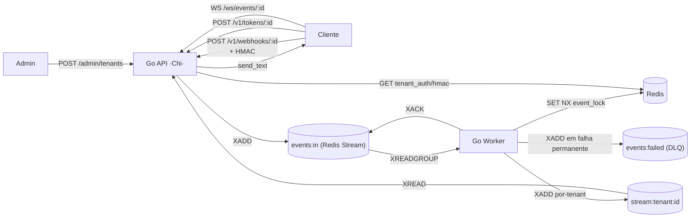

# Easyhooks

[](LICENSE)
[](https://go.dev/)
[](https://redis.io/)

[🇺🇸 English version](README.md)

Plataforma multi-tenant de **ingestão, processamento idempotente e distribuição
em tempo real** de webhooks. **Go (Chi) + Redis only** — sem Kafka, sem
PostgreSQL. Redis Streams compõem tanto a fila de trabalho (`events:in` /
`events:failed`) quanto os streams por tenant consumidos pelo WebSocket.

> **Documentação completa do produto:** site Docusaurus em
> <http://localhost:3001> (sobe via `docker compose up -d`).

---

## Sumário

- [Arquitetura](#arquitetura)
- [Stack](#stack)
- [Pré-requisitos](#pré-requisitos)
- [Quick Start (5 minutos)](#quick-start-5-minutos)
- [URLs e portas](#urls-e-portas)
- [Variáveis de ambiente](#variáveis-de-ambiente)
- [Planejamento de capacidade](#planejamento-de-capacidade)
- [Observabilidade](#observabilidade)
- [Testes](#testes)
- [Testes de carga](#testes-de-carga)
- [Documentação](#documentação)
- [Troubleshooting](#troubleshooting)
- [Contribuição](#contribuição)
- [Licença](#licença)
- [Disclaimer](#disclaimer)

---

## Arquitetura



- **`app`** — Go/Chi: Admin API, ingestor de webhooks, emissor de tokens WS,
  endpoint WebSocket, middleware de métricas HTTP. Faz `XADD events:in` para
  cada evento aceito.
- **`worker`** — Consumidor de Redis Streams (`XREADGROUP > webhook-workers`):
  lock de idempotência, retry exponencial, fan-out para os streams por tenant e
  DLQ em `events:failed`.
- **`redis`** — Único datastore. Guarda o hash do token de admin (seed),
  credenciais de tenants, locks de idempotência, a fila de trabalho e os streams
  por tenant. Persistência ativa (AOF a cada segundo + RDB).
- **`docs`** — Site Docusaurus (Nginx servindo o build estático).

A stack opcional de observabilidade (Prometheus, Grafana, Jaeger,
redis-exporter) vive em um compose separado — só sobe quando você quer.

---

## Stack

| Camada | Tecnologia |
| --- | --- |
| Linguagem | Go 1.26 (toolchain auto) |
| Web framework | Chi (`go-chi/chi`) + `net/http` stdlib |
| Datastore | Redis 7 (`go-redis/v9`) — credenciais, fila e streams |
| Fila de trabalho | Redis Streams (`events:in`, `events:failed`, grupo `webhook-workers`) |
| Observabilidade | Prometheus + Grafana + Jaeger (OpenTelemetry) — opcional |
| Testes de carga | Grafana k6 (`load_tests/k6/`, HTTP + WebSocket) |
| Testes | `testing` stdlib + `testify` + `miniredis` |
| Docs | Docusaurus 3 (Node 20 build → Nginx Alpine runtime) |
| Infra | Docker Compose |

---

## Pré-requisitos

- **Docker** ≥ 24 + **Docker Compose** v2.
- (Opcional, para rodar fora do Docker) **Go 1.26+**, **Node 20+**.
- (Opcional, recomendado) **`make`**, **`curl`**, **`jq`**, **`openssl`**.

No Windows, use **WSL2** ou **Docker Desktop**.

---

## Quick Start (5 minutos)

### 1. Clonar e configurar ambiente

```bash
git clone https://github.com/gbiumdonadon/easyhooks.git
cd easyhooks

cp .env.example .env
```

**Importante:** edite o `.env` e defina valores seguros para:

- `ADMIN_SEED_TOKEN`
- `APP_SECRET_KEY`
- `GRAFANA_ADMIN_PASSWORD` *(só se for subir o monitoramento)*

```bash
# Linux/macOS/WSL
openssl rand -hex 32

# Windows PowerShell
[Convert]::ToBase64String((1..32 | ForEach-Object { Get-Random -Maximum 256 }))
```

### 2. Subir o stack da aplicação

```bash
docker compose up -d
docker compose ps
```

### 3. (Opcional) Subir o stack de observabilidade

```bash
docker compose -f docker-compose.yml -f docker-compose.monitoring.yml up -d
```

Sobe Prometheus, Grafana, Jaeger e `redis-exporter` (com métricas de Redis
Streams habilitadas), tudo na mesma rede para conseguir scrapear `app:8000` e
`redis:6379`.

### 4. Verificar

- API: <http://localhost:8000/health>.
- Documentação: <http://localhost:3001>.
- Redis: `docker compose exec redis redis-cli ping` → `PONG`.
- Sanity do stream: `docker compose exec redis redis-cli XINFO GROUPS events:in`.

### 5. Criar seu primeiro tenant

```bash
curl -X POST http://localhost:8000/admin/tenants \
  -H "Authorization: Bearer <SEU_ADMIN_SEED_TOKEN>" \
  -H "Content-Type: application/json" \
  -d '{"name":"Acme Inc."}'
```

Resposta:

```json
{
  "tenant_id": "f1a2b3c4-d5e6-7890-abcd-ef0123456789",
  "secret_key": "a-very-long-base64url-secret-..."
}
```

> O `secret_key` é mostrado **uma única vez**. Guarde-o.

### 6. Enviar seu primeiro evento

```bash
export TENANT_ID="<o tenant_id retornado>"
export SECRET="<o secret_key retornado>"

BODY='{"event":"order.created","data":{"id":1}}'
SIG="sha256=$(printf '%s' "$BODY" | openssl dgst -sha256 -hmac "$SECRET" -hex | awk '{print $2}')"

curl -i -X POST "http://localhost:8000/v1/webhooks/$TENANT_ID" \
  -H "X-Webhook-Signature: $SIG" \
  -H "X-Event-Id: evt-001" \
  -H "Content-Type: application/json" \
  -d "$BODY"
```

Esperado: `HTTP/1.1 202 Accepted`.

### 7. Acompanhar o worker

```bash
docker compose logs -f worker
```

Saída típica:

```
INFO  Worker started stream=events:in dlq_stream=events:failed group=webhook-workers ...
INFO  Published event to stream tenant_id=f1a2b3c4-... stream_id=1700000000000-0
```

---

## URLs e portas

| Serviço | URL local | Porta interna | Descrição |
| --- | --- | --- | --- |
| API health | <http://localhost:8000/health> | 8000 | Health check |
| API root | <http://localhost:8000/> | 8000 | API Go (Chi) |
| Métricas | <http://localhost:8000/metrics> | 8000 | Métricas Prometheus |
| Documentação | <http://localhost:3001> | 80 | Site Docusaurus (Nginx) |
| Redis | localhost:6379 | 6379 | sem auth (dev) |
| **Grafana** *(opcional)* | <http://localhost:3000> | 3000 | Dashboards (creds do `.env`) |
| **Prometheus** *(opcional)* | <http://localhost:9090> | 9090 | Métricas & queries |
| **Jaeger** *(opcional)* | <http://localhost:16686> | 16686 | Tracing distribuído |

---

## Variáveis de ambiente

Todas configuráveis via `.env` na raiz. Copie `.env.example` → `.env`.

| Variável | Descrição | Default |
| --- | --- | --- |
| `EASYHOOKS_PROFILE` | Perfil de capacidade (`small`/`medium`/`large`/`custom`) — define defaults de memória | `small` |
| `REDIS_URL` | String de conexão Redis | `redis://redis:6379/0` |
| `REDIS_POOL_SIZE` | Tamanho do pool Redis (definido pelo perfil) | small=50, medium=100, large=200 |
| `ADMIN_SEED_TOKEN` | Token Bearer bootstrap do admin **(DEVE MUDAR)** | *(gerado)* |
| `APP_SECRET_KEY` | Chave para tokens WS **(DEVE MUDAR)** | *(gerada)* |
| `EVENT_STREAM_KEY` | Stream da fila de trabalho | `events:in` |
| `DLQ_STREAM_KEY` | Stream de DLQ | `events:failed` |
| `CONSUMER_GROUP` | Consumer group usado pelo worker | `webhook-workers` |
| `STREAM_BLOCK_MS` | Timeout do XREADGROUP (ms) | `5000` |
| `STREAM_COUNT` | Tamanho do batch por leitura | `32` |
| `WORKER_MAX_RETRIES` | Tentativas antes da DLQ | `3` |
| `WORKER_BACKOFF_BASE_MS` | Base do backoff exponencial (ms) | `100` |
| `IDEMPOTENCY_TTL_SECONDS` | TTL do lock de idempotência | `86400` |
| `WS_TOKEN_TTL_SECONDS` | TTL do token de WS | `300` |
| `AUTH_SESSION_TTL_SECONDS` | TTL do cache de sessão Bearer | `300` |
| `TENANT_EVENTS_STREAM_PREFIX` | Prefixo dos streams por tenant | `stream:tenant:` |
| `STREAM_MAX_LEN` | XADD MAXLEN ~ por stream de tenant (definido pelo perfil) | small=1000, medium=5000, large=10000 |
| `STREAM_HISTORY_COUNT` | Histórico no connect WS | `50` |
| `WS_FANOUT_BUFFER_SIZE` | Buffer do canal por subscriber WS (definido pelo perfil) | small=100, medium=256, large=512 |
| `INGEST_MAX_QUEUE_DEPTH` | High watermark de `XLEN events:in` — acima dele a API responde 429 (definido pelo perfil) | small=5000, medium=25000, large=50000 |
| `QUEUE_DEPTH_POLL_MS` | Frequência com que a API amostra `XLEN` para o load shedder | `1000` |
| `QUEUE_DEPTH_LOW_WATER_PCT` | Histerese: libera o shedding quando depth cai a `high * pct / 100` | `80` |
| `CORS_ORIGINS` | Origens CORS | `http://localhost:3001,http://localhost:3000` |
| `SECRET_KEY_BYTES` | Entropia do secret de tenant | `32` |
| `OTEL_EXPORTER_OTLP_ENDPOINT` | Endpoint OTLP (Jaeger) | `http://jaeger:4317` |
| `OTEL_SERVICE_NAME` | Nome do serviço para tracing | `easyhooks` |
| `METRICS_ENABLED` | Liga métricas Prometheus | `true` |
| `TRACING_ENABLED` | Liga tracing distribuído | `true` |
| `TRACING_SAMPLE_RATE` | Sampling rate (0.0–1.0) | `1.0` |
| `GRAFANA_ADMIN_USER` | User admin Grafana *(monitoramento)* | `admin` |
| `GRAFANA_ADMIN_PASSWORD` | Senha admin Grafana **(DEVE MUDAR)** | *(gerada)* |
| `LOADTEST_ADMIN_TOKEN` | Token admin para load tests (= `ADMIN_SEED_TOKEN`) | *(igual ao ADMIN_SEED_TOKEN)* |
| `LOADTEST_API_BASE_URL` | URL alvo dos load tests | `http://localhost:8000` |

> **Produção:** sempre defina `ADMIN_SEED_TOKEN`, `APP_SECRET_KEY` (e
> `GRAFANA_ADMIN_PASSWORD` ao habilitar monitoramento) via secret manager.
> Reduza `TRACING_SAMPLE_RATE` para 0.1–0.2.

---

## Planejamento de capacidade

O EasyHooks tem três perfis pré-tunados que escalam, em conjunto, limite de
memória, pool do Redis, tamanho dos streams por tenant, buffers do fanout e o
backpressure de ingestão. Escolha um perfil baseado no orçamento de memória
do container que você pode dedicar.

> **Garantia de comportamento.** O EasyHooks prioriza a integridade do
> servidor. Sob carga extrema ele prefere **rejeitar requisições novas
> com HTTP 429** a derrubar o serviço por falta de memória (OOM).

| Perfil | Container recomendado | `GOMEMLIMIT` | `INGEST_MAX_QUEUE_DEPTH` | `STREAM_MAX_LEN` | `REDIS_POOL_SIZE` |
| --- | --- | --- | --- | --- | --- |
| `small`  | 256 MB | 200 MiB | 5 000  | 1 000  | 50  |
| `medium` | 512 MB | 450 MiB | 25 000 | 5 000  | 100 |
| `large`  | 1 GB   | 900 MiB | 50 000 | 10 000 | 200 |
| `custom` | (seu)  | você define | você define | você define | você define |

Selecione um perfil no `.env`:

```env
EASYHOOKS_PROFILE=medium
```

Qualquer env var individual ainda vence sobre o perfil — `EASYHOOKS_PROFILE=large`
junto com `STREAM_MAX_LEN=20000` é uma combinação válida.

### Comportamento medido sob saturação

Números do `load_tests/scripts/run_capacity_benchmark.ps1` (máquina dev,
100 VUs do k6, 30 s sustentados, tenant único, payload ≈ 100 B). A carga do k6
excede de propósito a taxa de aceite de cada perfil para podermos comparar o
backpressure.

| Perfil | Cap do container | req/s ofertados | 202 aceitos (30 s) | 429 rejeitados (30 s) | p95 ingestão | RSS do app |
| --- | --- | --- | --- | --- | --- | --- |
| `small`  | 256 MB | ~4 700 | 5 446  | 135 812 | 1,58 ms | ~26 MiB |
| `medium` | 512 MB | ~4 700 | 28 827 | 112 370 | 1,58 ms | ~26 MiB |
| `large`  | 1 GB   | ~4 700 | 52 169 | 88 903  | 1,66 ms | ~27 MiB |

Os três perfis ficaram de pé — sem OOM, sem crash, sem panic. O caminho do 429
é barato (leitura atômica + retorno antecipado), por isso o p95 fica abaixo de
2 ms mesmo sob backpressure pesado. Perfis maiores absorvem picos maiores
antes de o shedding engatar.

Veja [`docs/docs/getting-started/dimensionamento.md`](docs/docs/getting-started/dimensionamento.md)
para o guia completo (knobs de tuning, observabilidade, metodologia, script
de reprodução).

> **Roadmap.** Um `sync.Pool` no caminho de ingestão foi propositalmente
> deixado fora desta release — o padrão de alocação atual está confortavelmente
> dentro do `GOMEMLIMIT` para a carga medida. Vamos revisitar se profiling
> mostrar que virou hot path.

---

## Observabilidade

```bash
docker compose -f docker-compose.yml -f docker-compose.monitoring.yml up -d
```

### Métricas-chave

#### 1. Backlog do worker (XPENDING) ⚠️ **CRÍTICA**

```promql
redis_stream_group_pending{stream="events:in",group="webhook-workers"}
```

#### 2. Tamanho dos streams

```promql
redis_stream_length{stream="events:in"}
redis_stream_length{stream="events:failed"}
```

#### 3. Taxa de DLQ

```promql
rate(webhook_dlq_total[5m]) / rate(stream_consume_total[5m])
```

#### 4. Latência p95

```promql
histogram_quantile(0.95, rate(webhook_processing_duration_seconds_bucket[5m]))
```

### Dashboards

Provisionados automaticamente:

1. **EasyHooks Overview** — RPS, p95, conexões WS, ratio de DLQ.
2. **EasyHooks Redis Streams Metrics** — XPENDING, throughput e XLEN.
3. **EasyHooks Load Test** — request rate, latência e backlog do stream
   durante runs do k6.

### Tracing

Spans típicos: `webhook.ingest` → `webhook.publish_stream` → `webhook.process`
(worker) → `webhook.business_handler` → `webhook.dispatch_to_dlq` (quando
aplicável) → `websocket.send`.

---

## Testes

```bash
cd go-api
go test ./...
go test -race ./...
```

A suíte usa `miniredis`; não exige um Redis real.

---

## Testes de carga

```bash
docker compose up -d
docker compose -f load_tests/docker-compose.loadtest.yml run --rm k6 \
  run k6/scenarios/baseline.js
```

| Cenário | Script | Objetivo |
| --- | --- | --- |
| Baseline | `k6/scenarios/baseline.js` | Carga moderada |
| Throughput | `k6/scenarios/throughput.js` | Maior RPS sustentado |
| WebSocket Scale | `k6/scenarios/websocket_scale.js` | Muitas conexões WS |
| Multi-Tenant | `k6/scenarios/multi_tenant.js` | Distribuir no pool |
| Stress | `k6/scenarios/stress.js` | Saturação |

Acompanhe o painel **Stream Pending Backlog** no dashboard EasyHooks Load Test
durante os runs — se crescer sem parar, o worker está saturando.

---

## Documentação

```bash
docker compose up -d docs
# http://localhost:3001
```

Edição com hot-reload:

```bash
cd docs
npm install
npm start
```

---

## Troubleshooting

### App não sobe — `connection refused` ao Redis

```bash
docker compose ps
docker compose logs redis
```

Espere o healthcheck do Redis ficar `healthy` (alguns segundos no primeiro boot).

### `403 Forbidden` ao postar webhook

1. HMAC calculado sobre body diferente do enviado (ex.: `echo` adicionou `\n`).
   Use `printf '%s'`.
2. Bearer token não confere com o `tenant_id` da URL (cross-tenant).

### `400 Bad Request — Missing required header X-Event-Id`

Header obrigatório (idempotência). Sempre envie um UUID/ULID único.

### Inspecionar a fila de trabalho

```bash
docker compose exec redis redis-cli XLEN events:in
docker compose exec redis redis-cli XINFO GROUPS events:in
docker compose exec redis redis-cli XPENDING events:in webhook-workers
```

### Inspecionar a DLQ

```bash
docker compose exec redis redis-cli XLEN events:failed
docker compose exec redis redis-cli XRANGE events:failed - + COUNT 10
```

O campo `x_original_error` em cada entrada traz o motivo da última falha.

### Inspecionar credenciais

```bash
docker compose exec redis redis-cli
> KEYS tenant_auth:*
> GET tenant_hmac_key:<tenant_id>
> EXISTS admin:token_hash
```

### Reset completo

```bash
docker compose down -v   # apaga o volume redis-data
docker compose up -d
```

---

## Contribuição

1. Adicione/estenda `*_test.go` em `go-api/`.
2. `cd go-api && go test ./...` até ficar verde.
3. `cd docs && npm run build` se mexeu na doc.

Estrutura de commit: `<tipo>: <resumo curto>` — `feat`, `fix`, `refactor`,
`test`, `docs`, `chore`.

---

## Licença

Apache License 2.0 — veja [LICENSE](LICENSE).

```
Copyright © 2026 Gustavo Bium Donadon
```

---

## Disclaimer

Este projeto é disponibilizado "como está" para fins de estudo e uso livre.
Embora implemente padrões prontos para produção (idempotência, retry, DLQ,
multi-tenancy), é destinado principalmente como ponto de partida educacional
para infraestrutura de webhooks.

**Use em produção por sua conta e risco.** Sempre realize auditorias de
segurança, testes de carga e customizações antes de promover.

---

**Construído com Go e Redis.**
