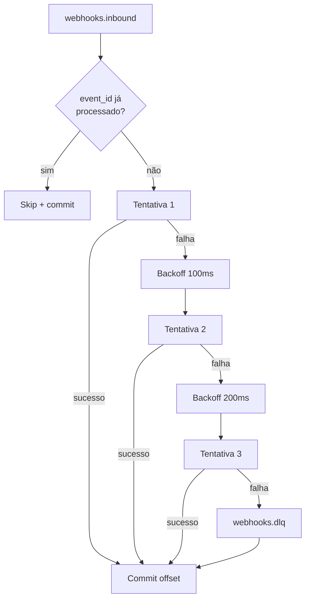

# Retentativas e Dead Letter Queue

Depois que a API responde `202 Accepted`, o evento entra no tópico Kafka `webhooks.inbound`. O `worker` consome essa fila e executa o handler de negócio (`business_handler`) com a seguinte política de **resiliência**:



## Política de retry

- **Máximo de tentativas:** `WORKER_MAX_RETRIES = 3` (configurável).
- **Backoff exponencial entre tentativas:** `100ms · 2^(attempt-1)`.
  - Tentativa 1 → falha → espera **100ms**.
  - Tentativa 2 → falha → espera **200ms**.
  - Tentativa 3 → falha → roteia para DLQ.
- **Base configurável:** `WORKER_BACKOFF_BASE_MS = 100`.
- O lock de idempotência no Redis (`event_lock:{event_id}`) **permanece** durante o retry — eventos em retry não são duplicados por re-consumo.

## O que vai para a DLQ

Após esgotar todas as tentativas, o worker **publica a mensagem original** no tópico Kafka `webhooks.dlq`, preservando:

- **Body:** o JSON original do evento.
- **Headers preservados:**
  - `tenant_id` — UUID do tenant (mesmo da mensagem original).
  - `event_id` — ID idempotente (mesmo da mensagem original).
- **Header adicionado:**
  - `x-original-error: <texto da exception>` — mensagem da última exceção que impediu o processamento.

## Garantias

- **Exactly-once interno** dentro da plataforma: o lock no Redis impede que o mesmo `event_id` seja processado duas vezes mesmo em caso de re-balanceamento de partições ou crash do worker entre tentativas.
- **At-least-once para entrega externa** (WebSocket / sistemas downstream): se o worker crashar **depois** de chamar o handler mas **antes** de commitar o offset, a mensagem pode ser reprocessada na subida seguinte. Por isso o `event_id` continua sendo a fonte de verdade para deduplicação no consumidor final.

> **Recomendação:** sempre projete consumidores downstream (incluindo o seu app que recebe via WebSocket) para serem **idempotentes** sobre o `event_id`. A plataforma garante exactly-once no processamento interno, mas a duplicação na entrega externa é possível em cenários raros.

## Como inspecionar a DLQ

Use o `kafka-console-consumer` dentro do container Kafka:

```bash
docker compose exec kafka kafka-console-consumer \
  --bootstrap-server localhost:9092 \
  --topic webhooks.dlq \
  --from-beginning \
  --property print.headers=true
```

Saída típica (uma linha por mensagem):

```
tenant_id:f1a2b3c4-...,event_id:evt-001,x-original-error:RuntimeError('downstream timeout'){"event":"order.created","data":{"id":1}}
```

### Reprocessando manualmente

Para reprocessar uma mensagem da DLQ, copie o body e republique no tópico de entrada com um **novo `event_id`** (ou apague a chave `event_lock:{event_id}` no Redis se quiser reusar o original):

```bash
# Apagar lock (se quiser reusar o mesmo event_id)
docker compose exec redis redis-cli DEL "event_lock:evt-001"

# Reenviar via API (recomendado, mais seguro que produzir direto)
curl -X POST "http://localhost:8000/v1/webhooks/$TENANT_ID" \
  -H "X-Webhook-Signature: $SIG" \
  -H "X-Event-Id: evt-001-retry-$(date +%s)" \
  -H "Content-Type: application/json" \
  -d "$BODY"
```

## Backoff no lado do cliente (5xx)

Se o **seu sistema downstream** cair temporariamente — e portanto a API recebe um `5xx` quando tenta entregar — você deve aplicar a **mesma política** no seu lado. Política recomendada para o cliente:

- Delay inicial: 1s.
- Multiplicador: 2x.
- Teto: 30s.
- Jitter aleatório: 0–1s.
- Reset ao primeiro sucesso.

Veja [WebSockets → Reconexão com backoff](../websockets/protocolo.md#reconexão-com-backoff-exponencial) para um exemplo executável.

## Observabilidade

O worker emite logs estruturados em cada decisão:

```
INFO  Acquired idempotency lock for event_id=evt-001 tenant=f1a2b3c4-...
INFO  Skipping duplicated event_id=evt-001 (already processed)
WARN  Retrying event_id=evt-001 attempt=2 backoff_ms=200 error=RuntimeError(...)
ERROR Routing event_id=evt-001 to DLQ after 3 attempts error=RuntimeError(...)
INFO  Published event to tenant channel tenant_events:f1a2b3c4-...
```

Recomenda-se exportar essas linhas para seu agregador (Loki, Datadog, etc.) e criar alertas em `Routing.*to DLQ` para detectar regressões em handlers de negócio.
