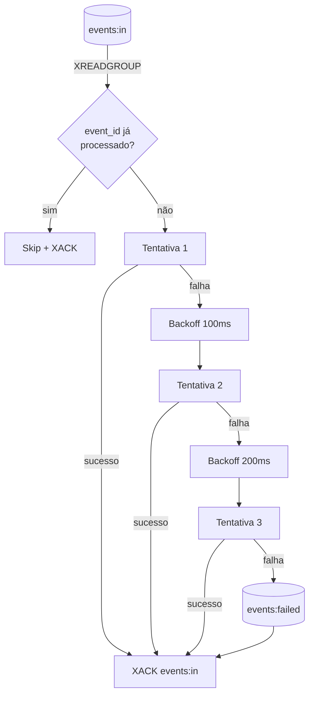

# Retentativas e Dead Letter Queue

Após a API responder `202 Accepted`, o evento é gravado no Redis Stream
`events:in`. O `worker` consome essa fila via `XREADGROUP > webhook-workers`,
executa o handler de negócio e segue a política de **resiliência** abaixo:



## Política de retry

- **Máximo de tentativas:** `WORKER_MAX_RETRIES = 3` (configurável).
- **Backoff exponencial entre tentativas:** `WORKER_BACKOFF_BASE_MS · 2^(attempt-1)`.
  - Tentativa 1 → falha → espera **100 ms**.
  - Tentativa 2 → falha → espera **200 ms**.
  - Tentativa 3 → falha → roteia para `events:failed`.
- O lock de idempotência (`event_lock:{event_id}`) permanece durante todo o
  retry — não há re-execução cruzada se outro consumidor reler a entrada
  pendente do PEL antes do `XACK`.

## O que vai para a DLQ

Após esgotar as tentativas, o worker faz `XADD events:failed` com os mesmos
campos da entrada original mais o erro:

| Campo | Conteúdo |
| --- | --- |
| `tenant_id` | UUID do tenant |
| `event_id` | `X-Event-Id` recebido pela API |
| `payload` | Body bruto do POST |
| `x_original_error` | Mensagem da última exceção que impediu o processamento |

A entrada de origem em `events:in` é **acked** logo em seguida — não fica como
pending nem é reentregue ao mesmo consumer group.

## Garantias

- **Exactly-once interno**: o `SET event_lock:{event_id} NX EX 86400` impede
  reprocesso quando o worker é reiniciado e a entrada continua no PEL.
- **At-least-once para entrega externa** (WebSocket / sistemas downstream): se
  o worker crashar **depois** de adicionar o evento ao stream do tenant mas
  **antes** do `XACK`, a entrada pode ser reprocessada — porém o lock no Redis
  faz com que o handler de negócio seja pulado.

> **Recomendação:** projete consumidores downstream (incluindo o seu app que
> recebe via WebSocket) para serem **idempotentes** sobre o `event_id`. A
> plataforma garante exactly-once no processamento interno, mas a duplicação
> na entrega externa é possível em cenários raros.

## Como inspecionar a DLQ

Inspecione a DLQ direto no Redis com `redis-cli` (o pipeline usa apenas Redis Streams):

```bash
# Quantas entradas existem?
docker compose exec redis redis-cli XLEN events:failed

# Últimas 10 entradas (mais recentes primeiro)
docker compose exec redis redis-cli XREVRANGE events:failed + - COUNT 10

# Tail em tempo real
docker compose exec redis redis-cli XREAD BLOCK 0 STREAMS events:failed '$'
```

Cada entrada vem no formato:

```
1) "1700000000000-0"
2) 1) "tenant_id"
   2) "f1a2b3c4-..."
   3) "event_id"
   4) "evt-001"
   5) "payload"
   6) "{\"event\":\"order.created\",...}"
   7) "x_original_error"
   8) "downstream timeout"
```

### Reprocessando manualmente

Para reprocessar uma entrada da DLQ, republique o evento via API com um **novo
`event_id`** (ou delete o lock no Redis para reutilizar o original):

```bash
# Reusar o mesmo event_id (apaga o lock primeiro)
docker compose exec redis redis-cli DEL "event_lock:evt-001"

# Reenviar via API (mais seguro que XADD direto)
curl -X POST "http://localhost:8000/v1/webhooks/$TENANT_ID" \
  -H "X-Webhook-Signature: $SIG" \
  -H "X-Event-Id: evt-001-retry-$(date +%s)" \
  -H "Content-Type: application/json" \
  -d "$BODY"
```

Quando confirmar o reprocessamento, remova a entrada antiga da DLQ:

```bash
docker compose exec redis redis-cli XDEL events:failed 1700000000000-0
```

## Backoff no lado do cliente (5xx)

Se o **seu sistema downstream** cair temporariamente — e a API responde com
`5xx` quando tenta entregar — aplique a **mesma política** no seu lado:

- Delay inicial: 1s.
- Multiplicador: 2x.
- Teto: 30s.
- Jitter aleatório: 0–1s.
- Reset ao primeiro sucesso.

Veja [WebSockets → Reconexão com backoff](../websockets/protocolo.md#reconexão-com-backoff-exponencial)
para um exemplo executável.

## Observabilidade

O worker emite logs estruturados em cada decisão:

```
INFO  Worker started stream=events:in dlq_stream=events:failed group=webhook-workers ...
INFO  Ignored duplicated event event_id=evt-001 tenant_id=f1a2b3c4-...
WARN  Business handler failed; will retry event_id=evt-001 attempt=2 max_retries=3 ...
ERROR Routed event to DLQ after exhausting retries event_id=evt-001 ...
INFO  Published event to stream tenant_id=f1a2b3c4-... stream_id=1700000000000-0
```

Recomenda-se exportar essas linhas para o seu agregador (Loki, Datadog, etc.)
e criar alertas em `Routed event to DLQ` para detectar regressões.

| Métrica | Para que olhar |
| --- | --- |
| `webhook_retries_total{attempt="2"}` | Detectar falhas transientes |
| `webhook_dlq_total{tenant_id,error_type}` | Tendência de DLQ por tenant |
| `redis_stream_length{stream="events:failed"}` | Profundidade da DLQ |
| `redis_stream_group_pending{stream="events:in",group="webhook-workers"}` | Backlog do worker (alerta antes do usuário sentir) |
