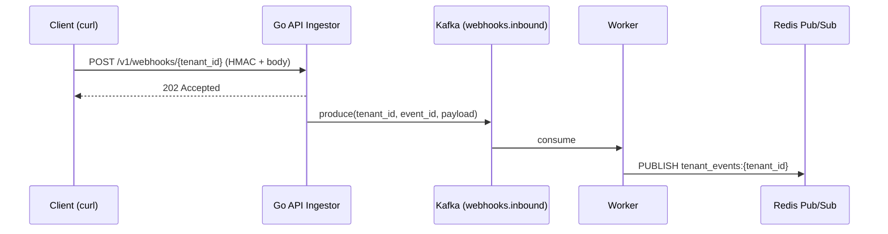

# First Event

With the tenant created in [Authentication](./authentication.md), let's send a complete webhook through the flow:



## 1. Ensure the stack is running

```bash
docker compose up -d
docker compose ps  # all services should be healthy
```

## 2. Create the tenant (if you haven't already)

See [Authentication](./authentication.md). At the end you'll have `TENANT_ID` and `SECRET` exported.

## 3. Build the payload and calculate HMAC

The platform requires `HMAC-SHA256` calculated over the **raw request body**, in the format `sha256=<hex>`. The header is `X-Webhook-Signature`.

In **bash** with `openssl`:

```bash
BODY='{"event":"order.created","data":{"id":1}}'
SIG="sha256=$(printf '%s' "$BODY" | openssl dgst -sha256 -hmac "$SECRET" -hex | awk '{print $2}')"
echo "$SIG"
```

> Use `printf '%s'` instead of `echo` to avoid the extra line break that `echo` adds — otherwise the signature will never match.

## 4. Send the webhook

```bash
curl -i -X POST "http://localhost:8000/v1/webhooks/$TENANT_ID" \
  -H "X-Webhook-Signature: $SIG" \
  -H "X-Event-Id: evt-001" \
  -H "Content-Type: application/json" \
  -d "$BODY"
```

Expected response:

```http
HTTP/1.1 202 Accepted
content-type: application/json

{"status":"accepted","tenant_id":"f1a2b3c4-..."}
```

## 5. Observe the event being processed

In another tab, follow the worker logs:

```bash
docker compose logs -f worker
```

You should see entries like:

```
INFO  Acquired idempotency lock for event_id=evt-001 tenant=f1a2b3c4-...
INFO  Published event to tenant channel tenant_events:f1a2b3c4-...
```

## 6. Resend the same event (idempotency)

Repeat the `curl` exactly the same. The API returns `202` again, but the worker logs:

```
INFO  Skipping duplicated event_id=evt-001 (already processed)
```

This demonstrates the **internal exactly-once** guarantee via Redis lock. Details in [Errors & DLQ → Retries](../errors/retries-dlq.md).

## 7. Next steps

- Implement [HMAC validation](../api-reference/hmac-security.md) in your system before sending real traffic.
- Connect a WebSocket client to receive events in real-time: [WebSockets → Connection](../websockets/connection.md).
