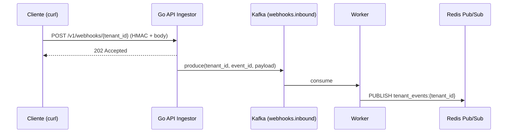

# Primeiro Evento

Com o tenant criado em [Autenticação](./autenticacao.md), vamos enviar um webhook completo passando pelo fluxo:



## 1. Garanta que o stack está no ar

```bash
docker compose up -d
docker compose ps  # todos os serviços devem estar healthy
```

## 2. Crie o tenant (caso ainda não tenha)

Veja [Autenticação](./autenticacao.md). No final você terá `TENANT_ID` e `SECRET` exportados.

## 3. Monte o payload e calcule o HMAC

A plataforma exige `HMAC-SHA256` calculado sobre o **corpo bruto da requisição**, no formato `sha256=<hex>`. O header é `X-Webhook-Signature`.

Em **bash** com `openssl`:

```bash
BODY='{"event":"order.created","data":{"id":1}}'
SIG="sha256=$(printf '%s' "$BODY" | openssl dgst -sha256 -hmac "$SECRET" -hex | awk '{print $2}')"
echo "$SIG"
```

> Use `printf '%s'` em vez de `echo` para evitar a quebra de linha extra que `echo` adiciona — caso contrário a assinatura nunca bate.

## 4. Envie o webhook

```bash
curl -i -X POST "http://localhost:8000/v1/webhooks/$TENANT_ID" \
  -H "X-Webhook-Signature: $SIG" \
  -H "X-Event-Id: evt-001" \
  -H "Content-Type: application/json" \
  -d "$BODY"
```

Resposta esperada:

```http
HTTP/1.1 202 Accepted
content-type: application/json

{"status":"accepted","tenant_id":"f1a2b3c4-..."}
```

## 5. Observe o evento sendo processado

Em outra aba, acompanhe os logs do worker:

```bash
docker compose logs -f worker
```

Você deve ver entradas como:

```
INFO  Acquired idempotency lock for event_id=evt-001 tenant=f1a2b3c4-...
INFO  Published event to tenant channel tenant_events:f1a2b3c4-...
```

## 6. Reenvie o mesmo evento (idempotência)

Repita o `curl` exatamente igual. A API retorna `202` novamente, mas o worker registra:

```
INFO  Skipping duplicated event_id=evt-001 (already processed)
```

Isto demonstra a garantia de **exactly-once interno** via lock no Redis. Detalhes em [Erros e DLQ → Retentativas](../errors/retentativas-dlq.md).

## 7. Próximos passos

- Implementar [validação HMAC](../api-reference/seguranca-hmac.md) no seu sistema antes de enviar tráfego real.
- Conectar um cliente WebSocket para receber os eventos em tempo real: [WebSockets → Conexão](../websockets/conexao.md).
