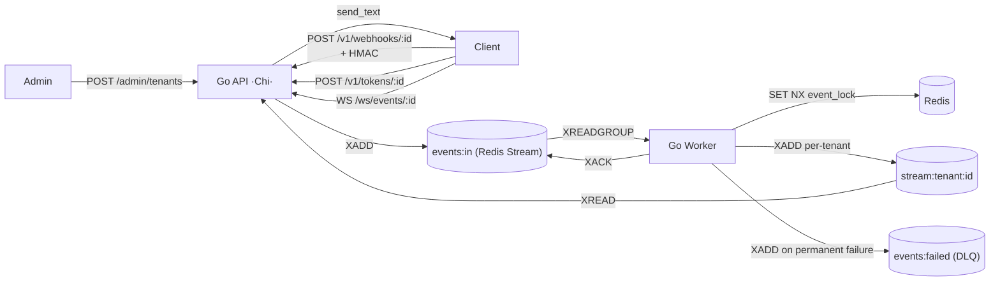

# Easyhooks

Multi-tenant platform for **ingestion, idempotent processing, and real-time distribution** of webhooks, built on a **Redis-only** stack. Designed to receive events from multiple clients, guarantee *at-least-once* delivery (with internal exactly-once via idempotency locks), and push processed events to frontends and downstream systems via WebSocket.

## High-Level Architecture

## Components

- **API (`app`)** — Go/Chi. Exposes the Admin API, the webhook ingestor, the WS token issuer and the WebSocket endpoint. On startup it seeds the bootstrap admin token and ensures the work-queue consumer group exists.
- **Worker** — Redis Streams consumer (`XREADGROUP > events:in`). Applies idempotency locks, exponential retry, fan-out to per-tenant streams, and routes permanent failures to `events:failed`.
- **Redis** — Sole datastore. Holds the bootstrap admin token hash (`admin:token_hash`), tenant credentials (`tenant_auth:{id}` / `tenant_hmac_key:{id}`), idempotency locks (`event_lock:{event_id}`), the work queue (`events:in` / `events:failed`) and the per-tenant fan-out streams (`stream:tenant:{id}`). AOF + RDB persistence are enabled by default so credentials and DLQ entries survive restarts.

## Guarantees

- **Isolated multi-tenancy** — Each tenant has unique credentials and its own per-tenant Redis Stream. Cross-tenant attempts are rejected with `403`.
- **Idempotency** — Same `X-Event-Id` sent N times is processed only once thanks to a `SET NX` lock.
- **Resilience** — Up to `WORKER_MAX_RETRIES` attempts (default 3) with exponential backoff; terminal failures go to the `events:failed` stream with the original error attached as the field `x_original_error`.
- **Real-time** — Processed events are appended to `stream:tenant:{id}` and delivered to connected WebSocket clients in milliseconds via `XREAD BLOCK`.
- **Security** — HMAC-SHA256 over the raw body + ephemeral tokens for WebSocket (HMAC of `APP_SECRET_KEY`).

## Getting Started

1. **[Quick Start → Authentication](./getting-started/authentication.md)** — create a tenant and get credentials.
2. **[Quick Start → First Event](./getting-started/first-event.md)** — send your first webhook in ~3 minutes.
3. **[API Reference → Ingestor](./api-reference/ingestor.md)** — complete reference of the main endpoint.
4. **[API Reference → HMAC Security](./api-reference/hmac-security.md)** — implement secure signing with examples in Python, Node, bash, and Go.
5. **[WebSockets → Connection](./websockets/connection.md)** — receive real-time events.
6. **[Errors & DLQ → Retries](./errors/retries-dlq.md)** — understand the retry policy and how to inspect `events:failed`.

## Stack

- **Language:** Go 1.26 (toolchain auto)
- **Framework:** Chi (`go-chi/chi`) + `net/http` stdlib
- **Datastore / work queue:** Redis 7 (`go-redis/v9`) — Redis Streams for both the work queue and the per-tenant fan-out
- **Tests:** `testing` stdlib + `testify` + `miniredis`
- **Infrastructure:** Docker Compose (`docker-compose.yml` for the app stack, `docker-compose.monitoring.yml` for the optional Prometheus/Grafana/Jaeger stack)
