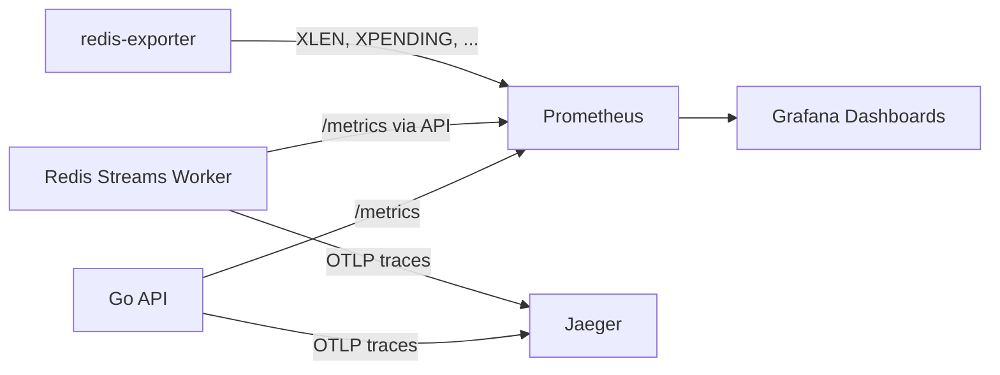

# Monitoring and Metrics

EasyHooks ships an **opt-in** observability stack — Prometheus, Grafana,
Jaeger and `redis-exporter` — that lives in `docker-compose.monitoring.yml`.
Bring it up with:

```bash
docker compose -f docker-compose.yml -f docker-compose.monitoring.yml up -d
```

## Quick access

- **Grafana dashboards**: http://localhost:3000 (creds from `.env` —
  `GRAFANA_ADMIN_USER` / `GRAFANA_ADMIN_PASSWORD`)
- **Prometheus UI**: http://localhost:9090
- **Jaeger tracing**: http://localhost:16686

## Architecture



`redis-exporter` is configured with
`REDIS_EXPORTER_CHECK_STREAMS=events:in,events:failed`, exposing
`redis_stream_length` and `redis_stream_group_pending` for the work queue and
the DLQ.

## Key metrics

### 1. Worker backlog (XPENDING) ⚠️ CRITICAL

The single most important metric — how many entries the worker has not acked
yet.

- **Query**: `redis_stream_group_pending{stream="events:in",group="webhook-workers"}`
- **Healthy**: < 100 pending
- **Warning**: 100 – 500
- **Critical**: > 1000

**Troubleshooting a high backlog:**

1. Scale the worker horizontally (`docker compose up -d --scale worker=N`).
2. Check worker logs for handler errors.
3. Verify Redis health (`redis-cli INFO`).
4. Profile the business handler — large payloads or slow downstreams will
   surface here.

### 2. Stream length (queue depth)

```promql
redis_stream_length{stream="events:in"}
redis_stream_length{stream="events:failed"}
```

- `events:in` length should track the publish/consume balance.
- `events:failed` should stay flat — any growth indicates terminal failures.

### 3. Error rate (DLQ ratio)

Messages that failed after all retry attempts versus what was consumed:

- **Query**: `rate(webhook_dlq_total[5m]) / rate(stream_consume_total[5m])`
- **Healthy**: < 1 %
- **Warning**: 1 – 5 %
- **Critical**: > 5 %

### 4. Processing duration

```promql
histogram_quantile(0.95, rate(webhook_processing_duration_seconds_bucket[5m]))
```

- **p50 (median)**: < 50 ms
- **p95**: < 200 ms
- **p99**: < 500 ms

### 5. Idempotency duplicates

```promql
rate(idempotency_duplicates_total[5m])
```

A non-zero rate is healthy (clients retried). A spike usually means a client
is misbehaving (retry storm).

### 6. Throughput

```promql
rate(stream_publish_total{stream="events:in",status="success"}[5m])
rate(stream_consume_total{stream="events:in"}[5m])
```

Publish and consume rates should track each other; a sustained gap means the
worker is falling behind (and `redis_stream_group_pending` will rise).

## Grafana dashboards

Three dashboards are auto-provisioned:

### EasyHooks Overview

System-wide:
- Webhook requests/sec
- Processing latency (p50, p95, p99)
- DLQ ratio
- Active WebSocket connections

### EasyHooks Redis Streams Metrics

Replaces the old "Kafka Metrics" view. Panels:

- **Worker Backlog (XPENDING)** — `redis_stream_group_pending`
- **Stream Throughput** — `stream_publish_total` vs `stream_consume_total`
- **Stream Length (XLEN)** — `events:in` and `events:failed`

### EasyHooks Load Test

Used while running k6 — request rate, latency percentiles, and the **Stream
Pending Backlog** panel for spotting saturation under load.

## Alerting recommendations

```yaml
groups:
  - name: easyhooks_critical
    rules:
      - alert: HighWorkerBacklog
        expr: redis_stream_group_pending{stream="events:in",group="webhook-workers"} > 1000
        for: 5m
        labels: { severity: critical }
        annotations:
          summary: "Worker backlog above 1k pending entries"
          description: "Worker is {{ $value }} entries behind"

      - alert: HighDLQRatio
        expr: rate(webhook_dlq_total[5m]) / rate(stream_consume_total[5m]) > 0.05
        for: 5m
        labels: { severity: warning }
        annotations:
          summary: "DLQ ratio above 5%"

      - alert: DLQGrowing
        expr: increase(redis_stream_length{stream="events:failed"}[10m]) > 0
        for: 10m
        labels: { severity: warning }
        annotations:
          summary: "Events keep landing in events:failed"

      - alert: RedisDown
        expr: up{job="redis-exporter"} == 0
        for: 1m
        labels: { severity: critical }
        annotations:
          summary: "Redis is down (sole datastore)"
```

## Best practices

### Monitor trends, not just current values

- Is the backlog growing or stable?
- Is the DLQ ratio drifting up?
- Are latencies trending up?

### Establish baselines

- Typical requests/sec.
- Normal processing duration.
- Expected DLQ ratio.
- Usual XPENDING values.

### Use template variables

Filter by tenant where it helps:

```promql
webhook_requests_total{tenant_id="$tenant_id"}
```

### Correlate metrics

When investigating issues, look at:

- XPENDING + DLQ ratio.
- Processing duration + retry rate.
- Redis command latency + processing duration.

## Metrics endpoint

The API exposes Prometheus metrics at:

```
GET http://localhost:8000/metrics
```

Sample:

```
# HELP webhook_requests_total Total number of webhook requests received
# TYPE webhook_requests_total counter
webhook_requests_total{tenant_id="xxx",status="accepted"} 1234

# HELP stream_consume_total Total number of messages consumed from a Redis Stream consumer group
# TYPE stream_consume_total counter
stream_consume_total{stream="events:in",consumer_group="webhook-workers"} 1234
```

## Configuration

`.env` toggles:

```bash
METRICS_ENABLED=true
TRACING_ENABLED=true

OTEL_SERVICE_NAME=easyhooks
OTEL_EXPORTER_OTLP_ENDPOINT=http://jaeger:4317
TRACING_SAMPLE_RATE=1.0  # 100% in dev, lower in prod (e.g. 0.1)
```

## Troubleshooting

### Metrics not showing up

1. Check Prometheus targets: http://localhost:9090/targets — both
   `easyhooks-api` and `redis-exporter` should be `UP`.
2. `curl http://localhost:8000/metrics` from your host.
3. Verify the monitoring stack is up: `docker compose ps prometheus grafana`.

### Stream metrics empty

`redis-exporter` only collects per-stream metrics for the keys passed in
`REDIS_EXPORTER_CHECK_STREAMS`. Streams with zero entries simply do not appear
yet — push at least one event and refresh.

### Dashboards empty

1. Verify the Prometheus datasource in Grafana.
2. Pick a time range with traffic (last 15 min).
3. Generate test traffic via the load tests or `curl`.

### High memory usage on Prometheus

Reduce retention or sampling:

```yaml
global:
  scrape_interval: 30s
```

## Next steps

- [Distributed tracing with Jaeger](./tracing.md)
