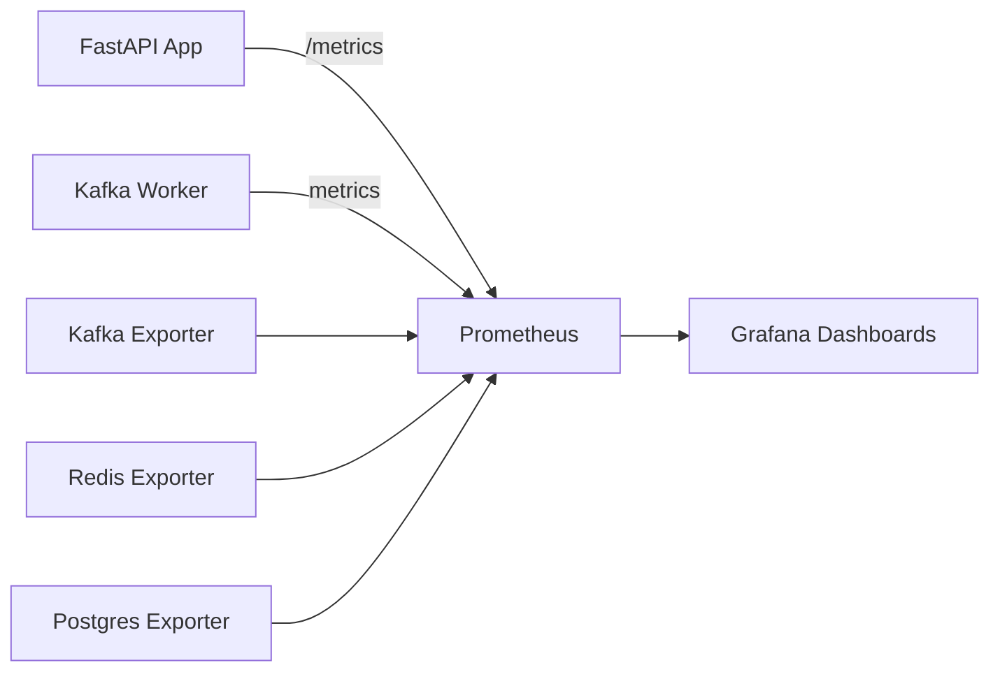

# Monitoring and Metrics

EasyHooks includes a complete observability stack with **Prometheus**, **Grafana**, and **Jaeger** for comprehensive monitoring of your webhook platform.

## Quick Access

After starting the stack with `docker compose up -d`:

- **Grafana Dashboards**: http://localhost:3000 (admin/admin)
- **Prometheus UI**: http://localhost:9090
- **Jaeger Tracing**: http://localhost:16686

## Architecture



## Key Metrics

### 1. Kafka Consumer Lag ⚠️ CRITICAL

**The most important metric to monitor.** It shows how many messages are waiting to be processed.

- **Query**: `kafka_consumergroup_lag{consumergroup="webhook-workers"}`
- **Healthy**: < 100 messages
- **Warning**: 100-500 messages
- **Critical**: > 1000 messages

**What it means:**
- **Low lag (< 100)**: Worker is keeping up with incoming webhooks ✅
- **Growing lag**: Worker is slower than ingestion rate 🔴
- **Shrinking lag**: Worker is catching up 🟡

**Troubleshooting high lag:**
1. Scale worker horizontally (add more worker containers)
2. Check worker logs for errors
3. Verify Redis/Kafka performance
4. Review webhook processing logic

### 2. Error Rate (DLQ)

Messages that failed after all retry attempts.

- **Query**: `rate(webhook_dlq_total[5m])`
- **Healthy**: < 1% of total messages
- **Warning**: 1-5%
- **Critical**: > 5%

**Common causes:**
- Invalid webhook payload
- Downstream service unavailable
- Processing timeout
- Business logic errors

### 3. Processing Duration

Time to process each webhook event.

- **Query**: `histogram_quantile(0.95, rate(webhook_processing_duration_seconds_bucket[5m]))`
- **p50 (median)**: < 50ms
- **p95**: < 200ms
- **p99**: < 500ms

### 4. Idempotency Duplicates

How many duplicate events were detected and skipped.

- **Query**: `rate(idempotency_duplicates_total[5m])`
- **Expected**: Low (indicates correct behavior)
- **High rate**: May indicate retry storms or client issues

### 5. Retry Distribution

Number of retries per attempt (1st, 2nd, 3rd).

- **Query**: `sum by (attempt) (rate(webhook_retries_total[5m]))`
- **Ideal**: Most events succeed on 1st attempt
- **Warning**: High 2nd/3rd attempt rates

## Grafana Dashboards

### EasyHooks Overview

Main dashboard showing:
- Webhook requests/sec
- Processing latency (p50, p95, p99)
- Error rates
- Active WebSocket connections

**Use case**: Real-time operations monitoring

### Kafka Metrics

Focus on Kafka health:
- **Consumer lag** (critical!)
- Throughput (produced vs consumed)
- Offset progression
- Consumer group status

**Use case**: Ensure worker keeps up with load

### Worker Processing

Detailed worker metrics:
- Events processed vs failed
- Retry attempts breakdown
- DLQ rate by error type
- Idempotency checks
- Processing time distribution

**Use case**: Debug processing issues

### Infrastructure

Low-level component monitoring:
- Redis: Commands/sec, latency, memory
- PostgreSQL: Connections, queries, cache hit
- Kafka: Disk usage, broker health

**Use case**: Infrastructure capacity planning

### WebSockets

Real-time delivery metrics:
- Active connections by tenant
- Messages sent/sec
- Connection lifecycle events
- Delivery latency

**Use case**: Monitor real-time distribution

## Alerting Recommendations

### Production Alerts

Configure these alerts in Prometheus:

```yaml
groups:
  - name: easyhooks_critical
    rules:
      - alert: HighKafkaLag
        expr: kafka_consumergroup_lag{consumergroup="webhook-workers"} > 1000
        for: 5m
        labels:
          severity: critical
        annotations:
          summary: "Kafka consumer lag is too high"
          description: "Worker is {{ $value }} messages behind"

      - alert: HighErrorRate
        expr: rate(webhook_dlq_total[5m]) / rate(kafka_consume_total[5m]) > 0.05
        for: 5m
        labels:
          severity: warning
        annotations:
          summary: "High webhook processing error rate"
          description: "{{ $value }}% of webhooks are failing"

      - alert: HighProcessingLatency
        expr: histogram_quantile(0.95, rate(webhook_processing_duration_seconds_bucket[5m])) > 1
        for: 10m
        labels:
          severity: warning
        annotations:
          summary: "High webhook processing latency"
          description: "p95 latency is {{ $value }}s"

      - alert: RedisDown
        expr: up{job="redis-exporter"} == 0
        for: 1m
        labels:
          severity: critical
        annotations:
          summary: "Redis is down"

      - alert: KafkaDown
        expr: up{job="kafka-exporter"} == 0
        for: 1m
        labels:
          severity: critical
        annotations:
          summary: "Kafka is down"
```

## Best Practices

### 1. Monitor Trends, Not Just Current Values

Look at metric trends over time:
- Is lag growing or stable?
- Is error rate increasing?
- Are latencies trending up?

### 2. Set Baselines

Establish normal operating ranges:
- Typical requests/sec
- Normal processing duration
- Expected error rate
- Usual lag values

### 3. Use Template Variables

Create tenant-specific dashboards:
```promql
# Filter by tenant_id
webhook_requests_total{tenant_id="$tenant_id"}
```

### 4. Correlate Metrics

When investigating issues, check:
- Kafka lag + error rate
- Processing duration + retry rate
- Redis latency + processing duration

### 5. Regular Reviews

- **Daily**: Check dashboards for anomalies
- **Weekly**: Review trends and capacity
- **Monthly**: Optimize based on patterns

## Metrics Endpoint

The API exposes Prometheus metrics at:

```
GET http://localhost:8000/metrics
```

Response format:
```
# HELP webhook_requests_total Total number of webhook requests received
# TYPE webhook_requests_total counter
webhook_requests_total{tenant_id="xxx",status="success"} 1234

# HELP webhook_processing_duration_seconds Time spent processing webhook events
# TYPE webhook_processing_duration_seconds histogram
webhook_processing_duration_seconds_bucket{tenant_id="xxx",le="0.005"} 100
webhook_processing_duration_seconds_bucket{tenant_id="xxx",le="0.01"} 250
...
```

## Configuration

Observability settings in `.env`:

```bash
# Enable/disable features
METRICS_ENABLED=true
TRACING_ENABLED=true

# OpenTelemetry configuration
OTEL_SERVICE_NAME=easyhooks
OTEL_EXPORTER_OTLP_ENDPOINT=http://jaeger:4317
TRACING_SAMPLE_RATE=1.0  # 100% in dev, lower in prod (e.g., 0.1)
```

## Troubleshooting

### Metrics not showing up

1. Check Prometheus targets: http://localhost:9090/targets
2. Verify all targets are "UP"
3. Check app logs for errors
4. Ensure containers are healthy: `docker compose ps`

### Dashboards empty

1. Verify Prometheus datasource in Grafana
2. Check time range (last 1 hour)
3. Generate some test traffic
4. Review Prometheus queries

### High memory usage

Reduce retention or sampling:
```yaml
# In prometheus.yml
global:
  scrape_interval: 30s  # Increase interval
```

## Next Steps

- [Distributed Tracing with Jaeger](./tracing.md)
- [Setting up Alerts](../errors/alerts.md)
- [Performance Tuning](../advanced/performance.md)
