# Distributed Tracing

EasyHooks uses **OpenTelemetry** and **Jaeger** to provide distributed tracing across the entire webhook lifecycle: from API ingestion to the `events:in` Redis Stream, through the worker, into the per-tenant fan-out streams and out to WebSocket clients.

## Quick Access

Jaeger UI: http://localhost:16686

## What is Distributed Tracing?

Tracing helps you understand:
- **Where** a message spent its time
- **Why** a webhook is slow
- **What** failed and where
- **How** components interact

## Trace Flow

A typical webhook trace includes these spans:

```mermaid
flowchart LR
    A[HTTP POST] --> B[webhook.ingest]
    B --> C[webhook.validate_hmac]
    C --> D[webhook.publish_stream]
    D --> E[webhook.process]
    E --> F[webhook.idempotency_check]
    F --> G[webhook.business_handler]
    G --> H[webhook.publish_redis]
    H --> I[websocket.send]
```



Each span shows:
- Duration
- Status (success/error)
- Attributes (tenant_id, event_id, etc.)
- Events (retries, errors)

## Using Jaeger

### Finding a Trace

1. Open http://localhost:16686
2. Select service: **easyhooks** or **easyhooks-worker**
3. Click "Find Traces"
4. Click on any trace to see details

### Search by Attributes

Filter traces by:
- **Tenant ID**: `tenant_id=xxx`
- **Event ID**: `event_id=evt-001`
- **Status**: `error=true`
- **Duration**: Min/Max duration

Example:
```
Service: easyhooks
Tags: tenant_id=abc-123 error=true
Min Duration: 1s
```

### Understanding the Timeline

**Waterfall view** shows:
- Parent-child relationships
- Parallel operations
- Sequential bottlenecks
- Time distribution

**Example interpretation:**

```
├─ webhook.ingest (200ms total)
   ├─ webhook.validate_hmac (5ms)
   └─ webhook.publish_stream (180ms) ← BOTTLENECK!
```

This trace shows the `XADD events:in` is the bottleneck (180 ms of 200 ms) —
investigate the Redis instance load or pool size.

## Key Spans

### webhook.ingest

API receives webhook request.

**Attributes:**
- `tenant_id`
- `event_id`
- `http.method`
- `http.status_code`

**Look for:**
- HMAC validation time
- Total ingestion duration

### webhook.process

Worker processes message.

**Attributes:**
- `tenant_id`
- `event_id`
- `attempt` (for retries)

**Look for:**
- Processing duration
- Retry events
- Error messages

### webhook.idempotency_check

Redis lock acquisition.

**Attributes:**
- `event_id`
- `duplicate` (true/false)

**Look for:**
- Redis latency
- Duplicate detection

### webhook.business_handler

Core processing logic.

**Attributes:**
- `tenant_id`
- `success` (true/false)

**Look for:**
- Business logic duration
- Custom attributes

### webhook.dispatch_to_dlq

Event sent to DLQ after failures.

**Attributes:**
- `tenant_id`
- `event_id`
- `error_type`

**Look for:**
- Why event failed
- Number of retries

## Troubleshooting with Traces

### Scenario 1: Slow Webhook Processing

**Problem:** Webhooks taking > 1 second

**Steps:**
1. Find traces with min duration > 1s
2. Look at waterfall view
3. Identify longest span(s)

**Common causes:**
- Slow `XADD events:in` (Redis pool exhausted, network)
- Slow per-tenant `XADD stream:tenant:{id}`
- Business handler timeout
- Slow downstream service called from the handler

### Scenario 2: High Error Rate

**Problem:** Many webhooks failing

**Steps:**
1. Filter by `error=true`
2. Group by `error_type`
3. Examine error messages

**Common patterns:**
- Specific tenant having issues
- Certain event types failing
- Infrastructure component down

### Scenario 3: Missing Events

**Problem:** Webhook sent but not delivered

**Steps:**
1. Search by `event_id`
2. Verify all expected spans exist
3. Check for missing spans

**Checklist:**
- ✅ `webhook.ingest` exists → API received it
- ✅ `webhook.process` exists → Worker consumed it
- ✅ `webhook.publish_redis` exists → Published to Redis
- ❌ `websocket.send` missing → Client not connected

### Scenario 4: Retry Storm

**Problem:** Same event retrying many times

**Steps:**
1. Search by `event_id`
2. Count number of traces
3. Look at retry events in spans

**Analysis:**
```
Trace 1: attempt=1, failed at 10:00:00
Trace 2: attempt=2, failed at 10:00:01
Trace 3: attempt=3, failed at 10:00:03
Trace 4: sent to DLQ at 10:00:06
```

## Custom spans (Go)

Tracing is initialized in `go-api/internal/observability/tracing.go` (`InitTracing`, global propagator). Handlers and the worker create spans with the **OpenTelemetry Go SDK** (`go.opentelemetry.io/otel`).

Example pattern inside a handler:

```go
ctx, span := observability.Tracer("easyhooks").Start(r.Context(), "my_operation")
defer span.End()
span.SetAttributes(attribute.String("tenant_id", tenantID.String()))
// ... do work with ctx ...
```

Use `attribute.*` from `go.opentelemetry.io/otel/attribute` and pass the derived `ctx` into downstream calls so child spans attach correctly.

## Context Propagation

The work queue runs entirely on Redis Streams, which do not carry OTel context
out of the box. Spans are therefore scoped to each side of the queue:

- **Go API** opens `webhook.ingest` → `webhook.publish_stream` and ends the
  trace once the entry is appended to `events:in`.
- **Go worker** starts a fresh trace `webhook.process` when it picks up the
  entry via `XREADGROUP`. To correlate sides, look up by `event_id` (a span
  attribute on both ends).

If you need a single end-to-end trace, propagate the OTel `traceparent` value
in the stream entry payload (e.g. as a header field inside the JSON envelope)
and re-inject it into the worker's context before starting the span.

## Performance Considerations

### Sampling in Production

Tracing has overhead. In production, sample traces:

```bash
# .env
TRACING_SAMPLE_RATE=0.1  # Trace 10% of requests
```

**Recommendations:**
- **Development**: 1.0 (100%)
- **Staging**: 0.5 (50%)
- **Production**: 0.1-0.2 (10-20%)

### Storage

Jaeger stores traces in memory by default:

```yaml
# For production, use Elasticsearch or Cassandra
environment:
  - SPAN_STORAGE_TYPE=elasticsearch
  - ES_SERVER_URLS=http://elasticsearch:9200
```

## Integration with Grafana

Grafana can show traces from Jaeger:

1. Jaeger datasource is pre-configured
2. Click on a metric spike
3. "View traces" → Jump to Jaeger

**Workflow:**
1. Grafana: Notice error spike at 14:30
2. Click "View traces for this time"
3. Jaeger opens with filtered traces
4. Investigate root cause

## Best Practices

### 1. Add meaningful attributes

Prefer stable, low-cardinality keys (`tenant_id`, `event_id`, `http.route`) on spans. Avoid high-cardinality blobs (full bodies, unbounded strings).

### 2. Use span events for state changes

In Go, use `span.AddEvent("retry", trace.WithAttributes(attribute.Int("attempt", 2)))` (or equivalent) for retries, cache hits, and fallbacks.

### 3. Don't over-instrument

**Good balance:**
- Service boundaries (API, Worker, External calls)
- Critical operations (HMAC, idempotency)
- Known bottlenecks

**Avoid:**
- Every function call
- Trivial operations (< 1ms)
- High-frequency loops

### 4. Correlate with logs

Include `trace_id` / `span_id` from `span.SpanContext()` in structured logs (`log/slog` fields) so logs and Jaeger views line up.

## Configuration

Tracing settings in `.env`:

```bash
# Enable/disable tracing
TRACING_ENABLED=true

# Jaeger endpoint (OTLP)
OTEL_EXPORTER_OTLP_ENDPOINT=http://jaeger:4317

# Service name
OTEL_SERVICE_NAME=easyhooks

# Sampling rate (0.0 to 1.0)
TRACING_SAMPLE_RATE=1.0
```

## Troubleshooting

### No traces appearing

1. Check tracing is enabled:
   ```bash
   docker compose logs app | grep -i "tracing configured"
   ```

2. Verify Jaeger is running:
   ```bash
   curl http://localhost:16686/api/services
   ```

3. Check OTLP endpoint connection

### Traces incomplete

**Missing spans** usually means:
- Error during span creation (check logs)
- Context not propagated (verify headers)
- Sampling excluded the span

### High overhead

Reduce sampling rate:
```bash
TRACING_SAMPLE_RATE=0.1
```

Or keep health checks cheap: the `GET /health` handler in the Go API should stay minimal; lower `TRACING_SAMPLE_RATE` in production rather than excluding every path unless you measure overhead.

## Next Steps

- [Metrics and Monitoring](./monitoring.md)
- [Performance Optimization](../advanced/performance.md)
- [Production Deployment](../deployment/production.md)
