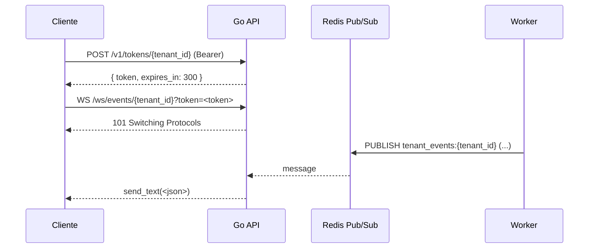

# Conectando ao WebSocket

Cada tenant tem um **canal exclusivo** de WebSocket no qual recebe os eventos publicados pelo worker (depois que passam por idempotência e processamento de negócio).



## Pré-requisito: obter um token

Veja [Tokens de WebSocket](../api-reference/tokens-ws.md). Em resumo:

```bash
WS_TOKEN=$(curl -s -X POST "http://localhost:8000/v1/tokens/$TENANT_ID" \
  -H "Authorization: Bearer $SECRET" \
  -H "Content-Type: application/json" | jq -r .token)
```

## URL do WebSocket

```
ws://localhost:8000/ws/events/{tenant_id}?token=<token>
wss://your-host/ws/events/{tenant_id}?token=<token>   # produção: sempre wss
```

- O `tenant_id` na URL **deve coincidir** com o `sub` do token, ou a conexão é fechada com código `1008`.
- O token é validado **antes** do `accept`. Se inválido / expirado / mismatch, o servidor envia `1008 Policy Violation` no handshake.

## Códigos de fechamento

- `1008` — Policy Violation: token ausente, malformado, expirado, ou tenant_id da URL não coincide com `sub` do token.
- `1011` — Internal Error: falha do servidor (raro; logar e tentar reconectar).
- `1000`/`1001` — fechamento normal pelo cliente ou servidor (ex.: shutdown do pod).

## Exemplo: navegador (`new WebSocket`)

```html
<script>
const TENANT_ID = 'f1a2b3c4-...';

async function fetchToken() {
  const r = await fetch(`/v1/tokens/${TENANT_ID}`, {
    method: 'POST',
    headers: {
      Authorization: `Bearer ${YOUR_SECRET}`,
      'Content-Type': 'application/json',
    },
  });
  return (await r.json()).token;
}

async function connect() {
  const token = await fetchToken();
  const ws = new WebSocket(
    `wss://your-host/ws/events/${TENANT_ID}?token=${encodeURIComponent(token)}`
  );

  ws.onopen = () => console.log('connected');
  ws.onmessage = (ev) => {
    const event = JSON.parse(ev.data);
    console.log('event received', event);
  };
  ws.onclose = (ev) => console.log('closed', ev.code, ev.reason);
  ws.onerror = (err) => console.error('ws error', err);
}

connect();
</script>
```

> Em browsers reais, **não** carregue o `secret_key` no front-end. Faça o `POST /v1/tokens` no backend do seu app e devolva apenas o token efêmero ao navegador.

## Exemplo: Python (`websockets`)

```python
import asyncio
import json
import httpx
import websockets

TENANT_ID = "f1a2b3c4-..."
SECRET = "a-very-long-base64url-secret-..."

async def fetch_token() -> str:
    async with httpx.AsyncClient() as client:
        r = await client.post(
            f"http://localhost:8000/v1/tokens/{TENANT_ID}",
            headers={"Authorization": f"Bearer {SECRET}"},
        )
        r.raise_for_status()
        return r.json()["token"]

async def main():
    token = await fetch_token()
    url = f"ws://localhost:8000/ws/events/{TENANT_ID}?token={token}"

    async with websockets.connect(url) as ws:
        async for raw in ws:
            event = json.loads(raw)
            print("event:", event)

asyncio.run(main())
```

## O que vem na mensagem

Cada `send_text` carrega o **valor JSON cru** que o cliente publicou no [ingestor](../api-reference/ingestor.md). Não há envelope adicional adicionado pela plataforma — você recebe exatamente o `body` original, com os mesmos campos enviados.

```json
{ "event": "order.created", "data": { "id": 1 } }
```

## Próximo passo

Veja [Protocolo](./protocolo.md) para entender heartbeats, reconexão com backoff e como o servidor mantém a conexão saudável.
