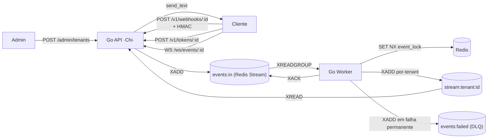

# Easyhooks

Plataforma multi-tenant de **ingestão, processamento idempotente e distribuição em tempo real** de webhooks, construída sobre uma stack **apenas com Redis**. Pensada para receber eventos de múltiplos clientes, garantir entrega *at-least-once* (com exactly-once interno via locks de idempotência), e empurrar os eventos processados para frontends e sistemas downstream via WebSocket.

## Arquitetura em alto nível

## Componentes

- **API (`app`)** — Go/Chi. Expõe a Admin API, o ingestor de webhooks, o emissor de tokens WS e o endpoint WebSocket. No startup, faz seed do token de admin e garante o consumer group da fila de trabalho.
- **Worker** — Consumidor de Redis Streams (`XREADGROUP > events:in`). Aplica lock de idempotência, retry exponencial, fan-out para os streams por tenant e roteia falhas terminais para `events:failed`.
- **Redis** — Único datastore. Guarda o hash do token de admin (`admin:token_hash`), credenciais de tenants (`tenant_auth:{id}` / `tenant_hmac_key:{id}`), locks de idempotência (`event_lock:{event_id}`), a fila de trabalho (`events:in` / `events:failed`) e os streams por tenant (`stream:tenant:{id}`). Persistência AOF + RDB ligada por padrão para que credenciais e DLQ sobrevivam a reinícios.

## Garantias

- **Multi-tenancy isolado** — Cada tenant tem credenciais únicas e um stream próprio. Tentativas cross-tenant são rejeitadas com `403`.
- **Idempotência** — O mesmo `X-Event-Id` enviado N vezes é processado apenas 1 vez graças a um `SET NX`.
- **Resiliência** — Até `WORKER_MAX_RETRIES` tentativas (padrão 3) com backoff exponencial; falhas terminais vão para `events:failed` com o erro original no campo `x_original_error`.
- **Tempo real** — Eventos processados são adicionados a `stream:tenant:{id}` e entregues a clientes WebSocket conectados em milissegundos via `XREAD BLOCK`.
- **Segurança** — HMAC-SHA256 sobre o body bruto + tokens efêmeros para WebSocket (HMAC do `APP_SECRET_KEY`).

## Por onde começar

1. **[Início Rápido → Autenticação](./getting-started/autenticacao.md)** — crie um tenant e obtenha credenciais.
2. **[Início Rápido → Primeiro Evento](./getting-started/primeiro-evento.md)** — envie seu primeiro webhook em ~3 minutos.
3. **[API Reference → Ingestor](./api-reference/ingestor.md)** — referência completa do endpoint principal.
4. **[API Reference → Segurança HMAC](./api-reference/seguranca-hmac.md)** — implemente assinatura segura com exemplos em Python, Node, bash e Go.
5. **[WebSockets → Conexão](./websockets/conexao.md)** — receba eventos em tempo real.
6. **[Erros e DLQ → Retentativas](./errors/retentativas-dlq.md)** — entenda a política de retry e como inspecionar a `events:failed`.

## Stack

- **Linguagem:** Go 1.26 (toolchain auto)
- **Framework:** Chi (`go-chi/chi`) + `net/http`
- **Datastore / fila de trabalho:** Redis 7 (`go-redis/v9`) — Redis Streams para a fila e para o fan-out por tenant
- **Testes:** `testing` + `testify` + `miniredis` (`go test ./...` em `go-api/`)
- **Infra:** Docker Compose (`docker-compose.yml` para o app, `docker-compose.monitoring.yml` opcional para Prometheus/Grafana/Jaeger)
