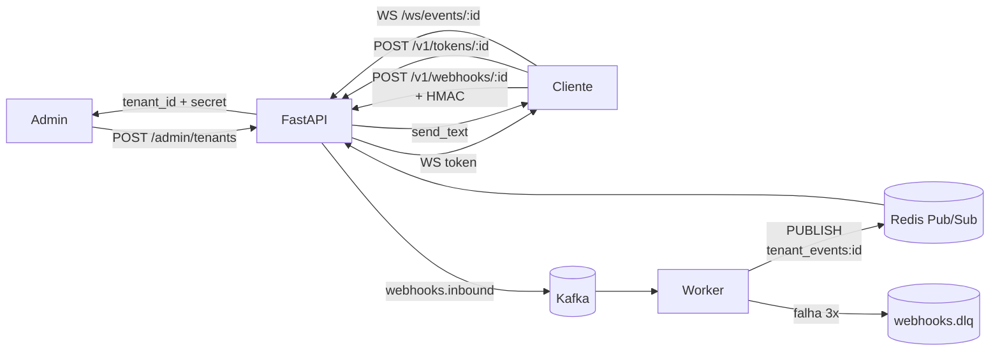

# Webhooks Platform

Plataforma multi-tenant de **ingestão, processamento idempotente e distribuição em tempo real** de webhooks. Pensada para receber eventos de múltiplos clientes, garantir entrega *at-least-once* (com exactly-once interno), e empurrar os eventos processados para frontends e sistemas downstream via WebSocket.

## Arquitetura em alto nível

## Componentes

- **API (`app`)** — FastAPI; expõe Admin API, ingestor, emissor de tokens WS e endpoint WebSocket.
- **Worker** — Consumidor Kafka dedicado; aplica idempotência (Redis), retry exponencial, DLQ e publicação no Pub/Sub.
- **Postgres** — Persistência de tenants e admins.
- **Redis** — Cache de credenciais (`tenant_auth:{id}`, `tenant_hmac_key:{id}`), locks de idempotência (`event_lock:{event_id}`) e canais Pub/Sub (`tenant_events:{id}`).
- **Kafka** — Buffer de eventos: `webhooks.inbound` (entrada) + `webhooks.dlq` (Dead Letter Queue).

## Garantias

- **Multi-tenancy isolado** — Cada tenant tem credenciais únicas e canal Pub/Sub próprio. Tentativas cross-tenant são rejeitadas com `403`.
- **Idempotência** — Mesmo `X-Event-Id` enviado N vezes é processado apenas 1.
- **Resiliência** — Até 3 tentativas de processamento com backoff exponencial; falhas terminais vão para DLQ com headers preservados.
- **Tempo real** — Eventos processados são publicados no Redis Pub/Sub e entregues a clientes WebSocket conectados em milissegundos.
- **Segurança** — HMAC-SHA256 sobre o body bruto + tokens efêmeros para WebSocket (HMAC do `APP_SECRET_KEY`).

## Por onde começar

1. **[Início Rápido → Autenticação](./getting-started/autenticacao.md)** — crie um tenant e obtenha credenciais.
2. **[Início Rápido → Primeiro Evento](./getting-started/primeiro-evento.md)** — envie seu primeiro webhook em ~3 minutos.
3. **[API Reference → Ingestor](./api-reference/ingestor.md)** — referência completa do endpoint principal.
4. **[API Reference → Segurança HMAC](./api-reference/seguranca-hmac.md)** — implemente assinatura segura com exemplos em Python, Node, bash e Go.
5. **[WebSockets → Conexão](./websockets/conexao.md)** — receba eventos em tempo real.
6. **[Erros e DLQ → Retentativas](./errors/retentativas-dlq.md)** — entenda a política de retry e como inspecionar a DLQ.

## Stack

- **Linguagem:** Python 3.12
- **Framework:** FastAPI + Uvicorn
- **ORM:** SQLAlchemy (asyncio)
- **Mensageria:** Apache Kafka (`aiokafka`)
- **Cache / Pub-Sub:** Redis 7+
- **Banco:** PostgreSQL 16+
- **Testes:** `pytest`, `pytest-asyncio`, `httpx`, `httpx-ws`, `testcontainers[kafka]`
- **Infra:** Docker Compose
